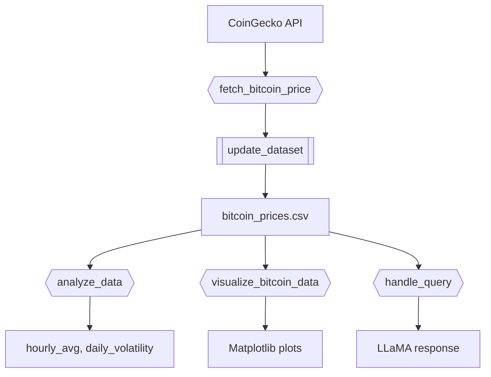

- [Real-Time Bitcoin Data Q\&A Bot with DocsGPT](#real-time-bitcoin-data-qa-bot-with-docsgpt)
  - [What is DocsGPT?](#what-is-docsgpt)
    - [Key Features](#key-features)
  - [Project Overview](#project-overview)
    - [Technologies Used](#technologies-used)
  - [Project Files](#project-files)
  - [Setup \& Dependencies](#setup--dependencies)
  - [Building \& Running with Docker](#building--running-with-docker)
    - [1. Go to project root](#1-go-to-project-root)
    - [2. Build Thin Client Environment](#2-build-thin-client-environment)
    - [3. Navigate to Project](#3-navigate-to-project)
    - [4. Activate Virtual Environment](#4-activate-virtual-environment)
    - [5. Build Docker Image](#5-build-docker-image)
    - [6. Launch Jupyter Notebook](#6-launch-jupyter-notebook)
  - [Project Architecture](#project-architecture)
  - [Functionality Demonstrated](#functionality-demonstrated)
  - [Example Queries](#example-queries)
  - [Environment Setup](#environment-setup)
  - [Useful Links](#useful-links)
  - [Is It Free?](#is-it-free)
  - [Future Extensions](#future-extensions)
  
# Real-Time Bitcoin Data Q&A Bot with DocsGPT

**Author**: Priyanshee Parmar  
**Date**: March 14, 2025  
**Difficulty**: Medium

---

## What is DocsGPT?

[DocsGPT](https://github.com/arc53/DocsGPT) is an open-source AI tool for querying your documents using natural language. Built on top of local LLMs like LLaMA, DocsGPT enables Retrieval-Augmented Generation (RAG) over formats like PDFs, CSVs, and Markdown.

### Key Features

- Ingest and index structured/unstructured files
- Query documents in natural language
- Run locally (no cloud dependency)
- Format support: PDF, DOCX, TXT, CSV, Markdown, HTML

---

## Project Overview

This project builds a **real-time Bitcoin Q&A CLI bot** using DocsGPT and CoinGecko API. It enables time-series financial insights like hourly averages, price spikes, and volatility patterns—accessible via natural language questions.

### Technologies Used

| Component       | Implementation Details              |
|----------------|--------------------------------------|
| API Client      | `requests` (CoinGecko API)          |
| Data Handling   | `pandas`, `datetime`, `numpy`       |
| LLM Engine      | `llama-cpp-python`                  |
| Local Model     | LLaMA-2 7B (`gguf`) format           |
| Visualization   | `matplotlib`, `seaborn`             |
| NLP Agent       | DocsGPT (self-hosted RAG system)    |

---

## Project Files

| File | Description |
|------|-------------|
| `BitcoinLLMQA.API.ipynb` | Native DocsGPT API usage (document ingestion, prompt querying, manual prompting) |
| `BitcoinLLMQA.API.md` | Markdown tutorial explaining what/why/how for each API step |
| `BitcoinLLMQA.example.ipynb` | Example notebook implementing full Bitcoin Q&A bot pipeline |
| `BitcoinLLMQA.example.md` | Markdown explanation of the project pipeline, architecture, and queries |
| `BitcoinLLMQA_utils.py` | Modular utility script for fetching, updating, analyzing, and visualizing data |

---

## Setup & Dependencies

```bash
git clone <your-repo-url>
cd Real-Time_Bitcoin_Data_QA_Bot_with_DocsGPT
```

Create a virtual environment:

```bash
python -m venv .venv
source .venv/bin/activate
pip install -r requirements.txt
```

OR use [Poetry](https://python-poetry.org/):

```bash
poetry install
```

---

## Building & Running with Docker

### 1. Go to project root

```bash
cd $GIT_ROOT
```

### 2. Build Thin Client Environment

```bash
./helpers_root/dev_scripts_helpers/thin_client/build.py
```

### 3. Navigate to Project

```bash
cd tutorial_docsgpt
```

### 4. Activate Virtual Environment

```bash
source dev_scripts_tutorial_docsgpt/thin_client/setenv.sh
```

### 5. Build Docker Image

```bash
i docker_build_local_image --version 1.0.0
```

### 6. Launch Jupyter Notebook

```bash
i docker_jupyter --skip-pull --stage local --version 1.0.0 -d
```

---

## Project Architecture



---

## Functionality Demonstrated

- **Real-time Ingestion**: Fetch price every 5 mins → CSV
- **Rolling Analysis**: 1-hour volatility + log returns
- **Natural Q&A**: Ask DocsGPT about recent price changes, volatility spikes, anomalies
- **LLM Integration**: LLaMA-2 7B loaded via `llama-cpp-python`
- **CLI Interface**: Chatbot with chat memory, data summarization, and multi-turn queries

---

## Example Queries

```python
handle_query(llm, "Maximum price in the last 6 hours?")
# Response: "The highest price was $31,994.18 at 2025-05-09 21:22 UTC."

handle_query(llm, "What are today's volatility spikes?")
# Response: "Two spikes detected: 0.393 at 21:22, and 0.381 at 18:37."
```

---

## Environment Setup

```python
import os
os.environ["LLAMA_CPP_LOG_LEVEL"] = "off"
os.environ["OPENAI_API_KEY"] = "<your_openai_key>"  # If using OpenAI fallback
```

---

## Useful Links

- [DocsGPT GitHub](https://github.com/arc53/DocsGPT)
- [CoinGecko API](https://www.coingecko.com/en/api)
- [Pandas Time Series Guide](https://pandas.pydata.org/docs/user_guide/timeseries.html)

---

## Is It Free?

Yes!  
- **DocsGPT** is completely open-source.  
- **CoinGecko API** offers a generous free tier (up to 50 calls/min).

---

## Future Extensions

- Telegram or Slack bot integration
- Multi-asset support (ETH, DOGE, etc.)
- Dashboard or Streamlit web interface
- Scheduled PDF reporting using LLM summaries

---

> This project demonstrates a lightweight but powerful pipeline combining real-time data, statistical analysis, and LLM-based question-answering over structured datasets.
