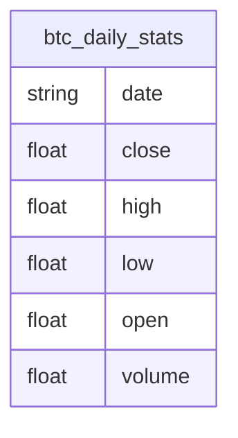

# Bitcoin Daily Price Analysis with SQLite & CoinMarketCap API

This notebook demonstrates how to fetch, store, and analyze daily Bitcoin (BTC) price and volume data using the CoinMarketCap API and SQLite. It serves as a clean, reproducible template for cryptocurrency market analysis with statistical and visual exploration.

---

## Table of Contents

- [Introduction](#introduction)
- [Notebook Structure](#notebook-structure)
- [Data Acquisition](#data-acquisition)
- [Database Operations](#database-operations)
- [Schema Diagram](#schema-diagram)
- [Data Analysis](#data-analysis)
  - [Moving Averages](#moving-averages)
  - [Volume Analysis](#volume-analysis)
  - [Bollinger Bands](#bollinger-bands)
  - [Rate of Change](#rate-of-change)
  - [Volatility](#volatility)
  - [Distribution Analysis](#distribution-analysis)
- [Visualization](#visualization)
- [References](#references)

---

## Introduction

This notebook focuses on a practical workflow for analyzing BTC daily data. It covers everything from collecting fresh data using CoinMarketCap, storing it in a SQLite database, and performing various time-series analyses to draw insights.

---

## Notebook Structure

The steps in the notebook follow a modular, logical flow:

- Load data
- Clean and preprocess
- Compute statistics and analytics
- Visualize trends and anomalies
- Store or update insights

Each block is well-commented for clarity and reproducibility.

---

## Data Acquisition

- Retrieves up to 15 years of BTC-USD daily data.
- Fetches live market data from CoinMarketCap.
- Updates local database (`btcDaily.db`) with new entries.

---

## Database Operations

- Uses SQLite for lightweight and persistent storage.
- Table schema example:

| date                | close  | high   | low    | open   | volume       |
|---------------------|--------|--------|--------|--------|--------------|
| 2014-09-17-00-00-00 | 457.33 | 468.17 | 452.42 | 465.86 | 21056800     |

- Supports dynamic querying using SQL.

---

## Schema Diagram

---

## Data Analysis

### Moving Averages
- Calculates 2, 30, and 120-day moving averages.
- Useful to smoothen volatility and detect trends.

### Volume Analysis
- Assesses how trading volume evolves.
- Flags sudden surges or dry periods.

### Bollinger Bands
- Applies a 20-day rolling mean and standard deviation to show dynamic price bands.

### Rate of Change
- Measures price change percentages over different windows (1d, 30d, 120d).
- Good for momentum detection.

### Volatility
- Rolling standard deviation to measure price fluctuation.

### Distribution Analysis
- Histogram of daily returns.
- Summarizes mean, median, and spread of market behavior.

---

## Visualization

- **Line plots**: For time trends of price and volume.
- **Candlestick charts**: To visualize open-high-low-close with Bollinger overlays.
- **Bar charts**: For rate-of-change visuals.
- **Histograms**: For return distributions.
- **Scatter plots**: To detect outliers or relationships.

---

## References

- [CoinMarketCap API Documentation](https://coinmarketcap.com/api/)
- [pandas Documentation](https://pandas.pydata.org/docs/)
- [sqlite3 Python Docs](https://docs.python.org/3/library/sqlite3.html)
- [mplfinance Documentation](https://github.com/matplotlib/mplfinance)

