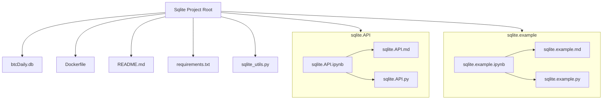

# Tutorial Template: Two Docker Approaches

# Jupyter Notebook Docker Environment

This project provides a Dockerized environment for running a Jupyter Notebook server with all dependencies specified in `requirements.txt`. The container launches Jupyter and opens the notebook `sqlite.example.ipynb` by default.

---
## File Structure



---

## Prerequisites

- [Docker](https://docs.docker.com/get-docker/) installed on your system.

---

## Build the Docker Image

1. **Clone this repository** (if you haven't already) and navigate to the project directory containing the `Dockerfile` and `requirements.txt`:

    ```
    cd /path/to/your/project
    ```

2. **Build the Docker image** (replace `sqliteapp` with your preferred image name):

    ```
    docker build -t sqliteapp:latest .
    ```

---

## Run the Docker Container

To start the Jupyter Notebook server and access it from your browser:
```
docker run –rm -p 8888:8888 sqliteapp:latest
```
- `--rm` automatically removes the container when it stops.
- `-p 8888:8888` maps port 8888 of the container to port 8888 on your host machine.

**Access Jupyter Notebook:**

- Open your browser and navigate to: [http://localhost:8888](http://localhost:8888)
- No token or password is required (as configured in the Dockerfile).

---
## Stopping the Container

- Press `Ctrl+C` in the terminal running the container to stop it.

---

## Customization

- To install additional Python packages, add them to `requirements.txt` and rebuild the image.
- To open a different notebook by default, modify the `CMD` line in the `Dockerfile`.

---

## Troubleshooting

- If you encounter issues with ports already in use, try a different host port (e.g., `-p 8889:8888`).
- Ensure Docker has permission to access the directory you want to mount.

---

## Delete the Docker Image and Clean Up Caches

### 1. **Stop and Remove All Containers**

First, stop any running containers based on your image:

```
docker ps -a
docker stop <container_id>
docker rm <container_id>
```

### 2. **Remove the Docker Image**

Find your image name or ID:
```
docker images
```

Remove the image by name or ID:
```
docker rmi sqliteapp:latest
```

### 3. **Remove Build Cache and Dangling Images**

To clean up unused images, build cache, and dangling data:
```
docker system prune
```

├── btcDaily.db
├── Dockerfile
├── README.md
├── requirements.txt
├── sqlite_utils.py
├── sqlite.API.ipynb
├── sqlite.API.md
├── sqlite.API.py
├── sqlite.example.ipynb
├── sqlite.example.md
└── sqlite.example.py
