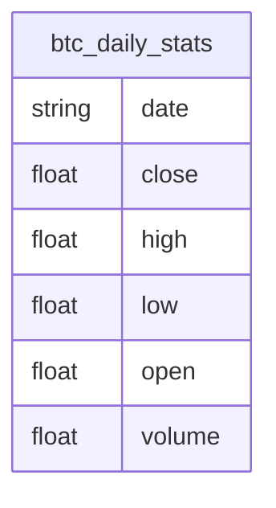

# API Reference: Bitcoin Market Data with SQLite & CoinMarketCap

This document describes backend API utilities for managing historical and live Bitcoin data using Python and SQLite. Leveraging Python, SQLite, and public APIs, it demonstrates best practices in data retrieval, storage, querying, and real-time updates.

---

## Table of Contents

- [Notebook Objectives](#notebook-objectives)
- [Notebook Structure](#notebook-structure)
- [Data Acquisition](#data-acquisition)
- [Database Operations](#database-operations)
- [Schema Details](#schema-details)
- [Schema Diagram](#schema-diagram)
- [Usage Instructions](#usage-instructions)
- [API Function Breakdown](#api-function-breakdown)
- [Data Analysis](#data-analysis)
  - [Moving Averages](#moving-averages)
  - [Volume Analysis](#volume-analysis)
  - [Bollinger Bands](#bollinger-bands)
  - [Rate of Change](#rate-of-change)
  - [Volatility](#volatility)
  - [Distribution Analysis](#distribution-analysis)
- [Visualization](#visualization)
- [Conclusion](#conclusion)
- [References](#references)

---

## Developer Guide

| Section                    | Description                                                                 |
|----------------------------|-----------------------------------------------------------------------------|
| **Setup and Imports**      | Initialize environment, import libraries, and configure notebook extensions.|
| **API Configuration**      | Set up API keys, endpoints, and request parameters for CoinMarketCap.      |
| **Historical Data Retrieval** | Fetch and inspect 15 years of daily BTC-USD historical data.           |
| **Data Storage**           | Persist historical data in a local SQLite database.                        |
| **Database Querying**      | Retrieve and analyze stored data using SQL queries.                        |
| **Live Data Fetching**     | Obtain the latest Bitcoin market data from CoinMarketCap.                  |
| **Database Update**        | Append new live data points to the SQLite database.                        |
| **Verification**           | Confirm successful updates and review the latest records in the database.  |

---

## Data Acquisition

- Retrieves up to 15 years of BTC-USD daily data.
- Fetches live market data from CoinMarketCap.
- Updates local database (`btcDaily.db`) with new entries.

---

## Database Operations

- Uses SQLite for lightweight and persistent storage.
- Supports dynamic querying using SQL.

---

## Schema Details

The schema is composed of a single main table: `btc_daily_stats`. Each row corresponds to one day's worth of Bitcoin market data.

### Column Descriptions:

- **date** *(string)* – Timestamp in `YYYY-MM-DD-HH-MM-SS` format.
- **close** *(float)* – Closing price of Bitcoin for that day.
- **high** *(float)* – Highest price reached that day.
- **low** *(float)* – Lowest price reached that day.
- **open** *(float)* – Opening price of Bitcoin that day.
- **volume** *(float)* – Total trading volume for that day.

---

## Schema Diagram

---

## Usage Instructions

1. **Environment Setup**: Ensure you have Python 3.x and the following packages installed:
   - `pandas`, `requests`, `sqlite3`, `mplfinance`, `yfinance`, `matplotlib`, `seaborn`
2. **API Key**: Insert your CoinMarketCap API key in the designated section.
3. **Run Notebook**: Execute each cell in order for a seamless data pipeline from retrieval to storage and live updates.

---

## API Function Breakdown
---

## Function Parameters and Returns

### `fetchHistoricalBTC()`
- **Parameters**: None  
- **Returns**: `pd.DataFrame` – Historical BTC price data  
- **Raises**: `ValueError` if data fetch fails

### `storeData(data: pd.DataFrame, db: str)`
- **Parameters**:
  - `data`: Cleaned BTC price DataFrame
  - `db`: SQLite DB path
- **Returns**: None

### `fetchDB(query: str, db: str)`
- **Parameters**:
  - `query`: SQL string
  - `db`: SQLite DB path
- **Returns**: `pd.DataFrame` with query result

### `liveBTC(url: str, API_KEY: str)`
- **Parameters**:
  - `url`: CoinMarketCap endpoint
  - `API_KEY`: Your API key
- **Returns**: Dictionary with date, open price, and volume

### `addDatapoint(liveData: dict, db: str)`
- **Parameters**:
  - `liveData`: Dict with latest BTC data
  - `db`: SQLite DB path
- **Returns**: None

---

### `fetchHistoricalBTC()`
- **Purpose**: Downloads historical BTC price data using the Yahoo Finance API.
- **Behind the scenes**: Calls `yf.download()` and reshapes columns to the desired schema. Converts the datetime index into a formatted string for SQLite compatibility.

### `storeData(data, db)`
- **Purpose**: Persists a DataFrame into the SQLite database.
- **Behind the scenes**: Uses `pandas.to_sql()` to replace or insert data into the `btc_daily_stats` table. Handles the SQLite connection lifecycle.

### `fetchDB(query, db)`
- **Purpose**: Executes a custom SQL query and returns the result.
- **Behind the scenes**: Connects to SQLite using `sqlite3.connect`, runs `pd.read_sql_query`, and closes the connection after fetching.

### `liveBTC(url, API_KEY)`
- **Purpose**: Fetches real-time Bitcoin stats from CoinMarketCap.
- **Behind the scenes**: Makes a `GET` request with proper headers and query parameters. Parses the JSON to extract timestamp, open price, and volume.

### `addDatapoint(liveData, db)`
- **Purpose**: Inserts a new live data row into the database.
- **Behind the scenes**: Uses `sqlite3` to prepare and execute an `INSERT` SQL command. Converts the date to match the schema format before inserting.

---

## Data Analysis

### Moving Averages
- Calculates 2, 30, and 120-day moving averages.
- Useful to smoothen volatility and detect trends.

### Volume Analysis
- Assesses how trading volume evolves.
- Flags sudden surges or dry periods.

### Bollinger Bands
- Applies a 20-day rolling mean and standard deviation to show dynamic price bands.

### Rate of Change
- Measures price change percentages over different windows (1d, 30d, 120d).
- Good for momentum detection.

### Volatility
- Rolling standard deviation to measure price fluctuation.

### Distribution Analysis
- Histogram of daily returns.
- Summarizes mean, median, and spread of market behavior.

---

## Visualization

- **Line plots**: For time trends of price and volume.
- **Candlestick charts**: To visualize open-high-low-close with Bollinger overlays.
- **Bar charts**: For rate-of-change visuals.
- **Histograms**: For return distributions.
- **Scatter plots**: To detect outliers or relationships.

---

## Conclusion

This analysis framework captures the essential building blocks for time-series analysis of cryptocurrency data:

- The SQLite schema is deliberately simple and efficient, making queries fast and the structure easy to maintain.
- Visual tools like moving averages, Bollinger Bands, and volatility metrics help identify key trends and shifts in the BTC market.
- The setup supports easy extension to other coins, new metrics, or integration with different APIs.

By storing everything locally in SQLite and visualizing data in Python, this solution remains fast, cost-effective, and highly transparent.

---

## References

- [CoinMarketCap API Documentation](https://coinmarketcap.com/api/)
- [pandas Documentation](https://pandas.pydata.org/docs/)
- [sqlite3 Python Docs](https://docs.python.org/3/library/sqlite3.html)
- [mplfinance Documentation](https://github.com/matplotlib/mplfinance)

---

---

## Developer Notes

- Designed for use in scheduled jobs, automation scripts, or real-time dashboards.
- Can be easily adapted for other cryptocurrencies or integrated into trading systems.
- Avoids unnecessary recomputation by updating only the latest datapoint.

