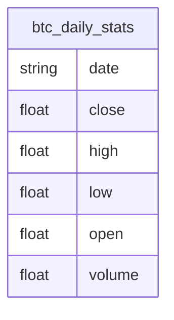

# Tutorial: Daily Bitcoin Price Analysis with SQLite

This beginner-friendly notebook walks you through fetching, storing, and analyzing Bitcoin data step-by-step using Python. It serves as a clean, reproducible template for cryptocurrency market analysis with statistical and visual exploration.

---

## Table of Contents

- [Introduction](#introduction)
- [Notebook Structure](#notebook-structure)
- [Data Acquisition](#data-acquisition)
- [Database Operations](#database-operations)
- [Schema Details](#schema-details)
- [Schema Diagram](#schema-diagram)
- [Data Analysis](#data-analysis)
  - [Moving Averages](#moving-averages)
  - [Volume Analysis](#volume-analysis)
  - [Bollinger Bands](#bollinger-bands)
  - [Rate of Change](#rate-of-change)
  - [Volatility](#volatility)
  - [Distribution Analysis](#distribution-analysis)
- [Visualization](#visualization)
- [Conclusion](#conclusion)
- [References](#references)

---

## Introduction

This notebook focuses on a practical workflow for analyzing BTC daily data. It covers everything from collecting fresh data using CoinMarketCap, storing it in a SQLite database, and performing various time-series analyses to draw insights.

---


---

## Learning Goals

By the end of this tutorial, you will:

- Understand how to use APIs and SQL together in Python.
- Learn to compute and visualize technical indicators like moving averages and Bollinger Bands.
- Gain hands-on experience in managing time-series data with SQLite.

---

## Notebook Structure

The steps in the notebook follow a modular, logical flow:

- Load data
- Clean and preprocess
- Compute statistics and analytics
- Visualize trends and anomalies
- Store or update insights

Each block is well-commented for clarity and reproducibility.

---


---

## Step-by-Step Tutorial

### 1. Fetch Historical Data

We begin by retrieving 15 years of daily BTC data.  
Run the following code block:

```python
df = fetchHistoricalBTC()
print(df.head())
```

You should see columns like `open`, `high`, `low`, etc.

---

### 2. Store Data in SQLite

Now let’s save the data into our SQLite database:

```python
storeData(df, 'btcDaily.db')
```

---

### 3. Query the Database

You can extract data using SQL queries:

```python
query = "SELECT * FROM btc_daily_stats ORDER BY date DESC LIMIT 5;"
recent_data = fetchDB(query, 'btcDaily.db')
print(recent_data)
```

---

### 4. Add Live Data

Fetch and store today’s live BTC data:

```python
live = liveBTC(url, API_KEY)
addDatapoint(live, 'btcDaily.db')
```

---

## Data Acquisition

- Retrieves up to 15 years of BTC-USD daily data.
- Fetches live market data from CoinMarketCap.
- Updates local database (`btcDaily.db`) with new entries.

---

## Database Operations

- Uses SQLite for lightweight and persistent storage.
- Supports dynamic querying using SQL.

---

## Schema Details

The schema is composed of a single main table: `btc_daily_stats`. Each row corresponds to one day's worth of Bitcoin market data.

### Column Descriptions:

- **date** *(string)* – Timestamp in `YYYY-MM-DD-HH-MM-SS` format.
- **close** *(float)* – Closing price of Bitcoin for that day.
- **high** *(float)* – Highest price reached that day.
- **low** *(float)* – Lowest price reached that day.
- **open** *(float)* – Opening price of Bitcoin that day.
- **volume** *(float)* – Total trading volume for that day.

---

## Schema Diagram



---

## Data Analysis

### Moving Averages
- Calculates 2, 30, and 120-day moving averages.
- Useful to smoothen volatility and detect trends.

### Volume Analysis
- Assesses how trading volume evolves.
- Flags sudden surges or dry periods.

### Bollinger Bands
- Applies a 20-day rolling mean and standard deviation to show dynamic price bands.

### Rate of Change
- Measures price change percentages over different windows (1d, 30d, 120d).
- Good for momentum detection.

### Volatility
- Rolling standard deviation to measure price fluctuation.

### Distribution Analysis
- Histogram of daily returns.
- Summarizes mean, median, and spread of market behavior.

---

## Visualization

- **Line plots**: For time trends of price and volume.
- **Candlestick charts**: To visualize open-high-low-close with Bollinger overlays.
- **Bar charts**: For rate-of-change visuals.
- **Histograms**: For return distributions.
- **Scatter plots**: To detect outliers or relationships.

---

## Conclusion

This analysis framework captures the essential building blocks for time-series analysis of cryptocurrency data:

- The SQLite schema is deliberately simple and efficient, making queries fast and the structure easy to maintain.
- Visual tools like moving averages, Bollinger Bands, and volatility metrics help identify key trends and shifts in the BTC market.
- The setup supports easy extension to other coins, new metrics, or integration with different APIs.

By storing everything locally in SQLite and visualizing data in Python, this solution remains fast, cost-effective, and highly transparent.

---

## References

- [CoinMarketCap API Documentation](https://coinmarketcap.com/api/)
- [pandas Documentation](https://pandas.pydata.org/docs/)
- [sqlite3 Python Docs](https://docs.python.org/3/library/sqlite3.html)
- [mplfinance Documentation](https://github.com/matplotlib/mplfinance)

---

