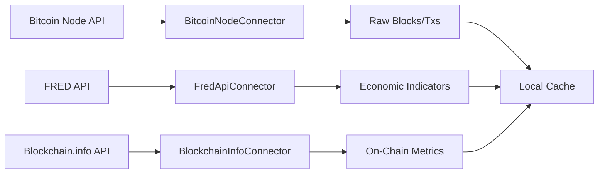
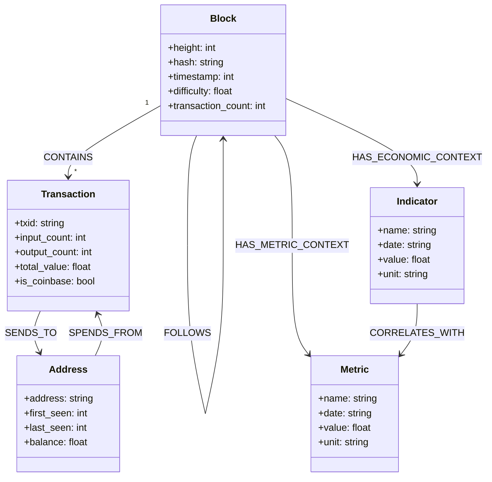
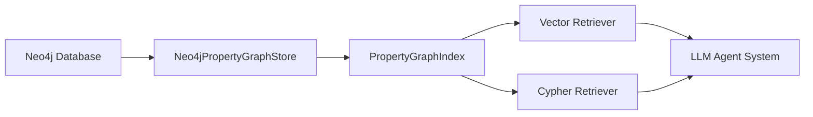
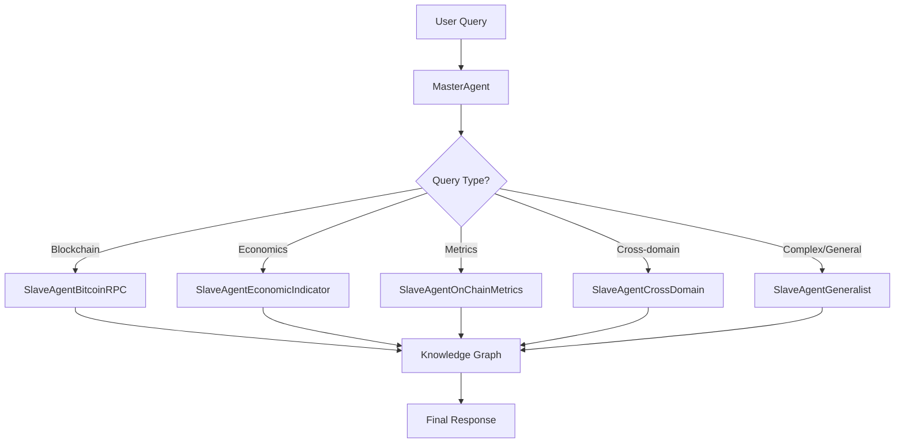
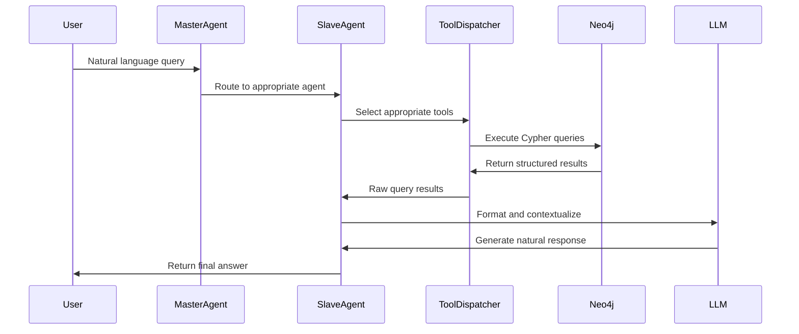
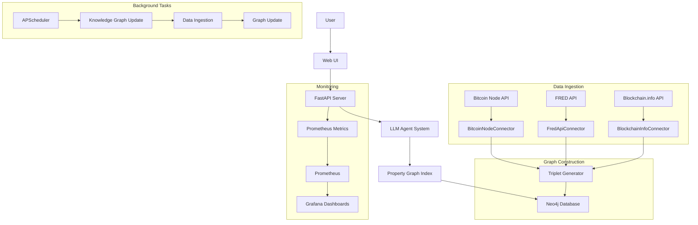

<!-- toc -->

# Enterprise-Scale Bitcoin Data Knowledge Graph with LlamaIndex

<!-- toc -->

- [Introduction](#introduction)
- [Data Connectors](#data-connectors)
  * [Bitcoin Node Connector](#bitcoin-node-connector)
  * [Economic Data Connector](#economic-data-connector)
  * [On-Chain Metrics Connector](#on-chain-metrics-connector)
  * [Data Flow Architecture](#data-flow-architecture)
- [Knowledge Graph Construction](#knowledge-graph-construction)
  * [Triplets: The Building Blocks](#triplets-the-building-blocks)
  * [Entity and Relationship Design](#entity-and-relationship-design)
  * [Neo4j Graph Database](#neo4j-graph-database)
  * [Knowledge Graph Index](#knowledge-graph-index)
- [LLM Agent System](#llm-agent-system)
  * [Master-Slave Architecture](#master-slave-architecture)
  * [Agent Specialization](#agent-specialization)
  * [Query Processing Flow](#query-processing-flow)
  * [Information Retrieval Techniques](#information-retrieval-techniques)
- [API and Web Interface](#api-and-web-interface)
  * [FastAPI Implementation](#fastapi-implementation)
  * [Asynchronous Processing](#asynchronous-processing)
  * [Background Tasks](#background-tasks)
- [Monitoring and Observability](#monitoring-and-observability)
  * [Prometheus Metrics](#prometheus-metrics)
  * [Grafana Dashboards](#grafana-dashboards)
  * [System Health Indicators](#system-health-indicators)
- [Complete System Architecture](#complete-system-architecture)
  * [Component Integration](#component-integration)
  * [Data Flow](#data-flow)
  * [Scaling Considerations](#scaling-considerations)
- [Getting Started](#getting-started)
  * [Prerequisites](#prerequisites)
  * [Installation](#installation)
  * [Usage Examples](#usage-examples)
- [Future Enhancements](#future-enhancements)
- [Appendix](#appendix)

<!-- tocstop -->

## Introduction

This project demonstrates how to build an enterprise-scale Bitcoin data knowledge graph using LlamaIndex. The system ingests diverse data sources (blockchain data, economic indicators, and on-chain metrics), constructs a rich knowledge graph, and enables natural language querying through specialized LLM-powered agents. The implementation showcases how to handle petabyte-scale data, build effective semantic search capabilities, and deploy a monitored production system.

Key features include:
- Multi-source data ingestion from Bitcoin node, economic APIs, and on-chain metrics
- Knowledge graph construction with optimized entity-relationship modeling
- Specialized agent system for intelligent, domain-specific querying
- FastAPI service with background processing and real-time updates
- Full production monitoring with Prometheus and Grafana

## Data Connectors

Our system integrates three primary data sources, each requiring a specialized connector to handle its unique data structure and access patterns.

### Bitcoin Node Connector

The Bitcoin Node Connector (`bitcoinrpc.py`) provides access to raw blockchain data. We use a public Bitcoin node API to fetch blocks and transactions.

**Design Decisions:**
- **Public Node Access**: Rather than running a full node (~500GB), we leverage a public API with token-based authentication, making the project more accessible.
- **Selective Data Extraction**: Instead of ingesting the entire blockchain history (which would be petabytes), we extract only essential fields needed for our knowledge graph.
- **Rate Limiting**: Implemented automatic request throttling to respect API limits and ensure reliable data ingestion.

**Key Methods:**
- `get_blockchain_info()`: Retrieves blockchain metadataCypher-Optimized Property Graph for Bitcoin Data
- `get_block_by_height()`: Fetches blocks by height with configurable verbosity
- `get_transactions_for_block()`: Extracts transactions from blocks
- `extract_block_data()` and `extract_transaction_data()`: Clean and standardize raw data for knowledge graph ingestion

### Economic Data Connector

The Economic Data Connector (`fred.py`) fetches macroeconomic indicators from the Federal Reserve Economic Data (FRED) API.

**Design Decisions:**
- **Indicator Selection**: We chose specific economic indicators like Federal Funds Rate, CPI, GDP growth, that historically correlate with Bitcoin performance.
- **Standardized Output Format**: All economic data is transformed into a consistent timeseries format for seamless integration with the knowledge graph.
- **Time Alignment**: Implemented date conversion and alignment to match economic indicators (often daily/monthly) with blockchain data (block intervals).

**Key Methods:**
- `get_metric()`: Generic method to fetch any supported economic indicator
- `fetch_all_metrics()`: Batch retrieval for efficient processing
- `series_to_json()`: Conversion to a consistent format for knowledge graph ingestion

### On-Chain Metrics Connector

The On-Chain Metrics Connector (`blockchaininfo.py`) collects Bitcoin network metrics from Blockchain.info API.

**Design Decisions:**
- **Complementary Metrics**: Selected metrics that aren't directly available in raw blockchain data but provide crucial network insights.
- **Historical Retrieval**: Implemented timespan-based fetching to collect historical metric snapshots.
- `Metric Mapping**: Created a standardized taxonomy of metrics across different source APIs.

**Key Methods:**
- `get_metric()`: Fetches any supported metric with time-based filtering
- `get_transaction_volume_btc()`, `get_active_addresses()`, etc.: Specialized methods for specific metrics
- `metrics_to_dataframe()`: Conversion to tabular format for analysis and visualization

### Data Flow Architecture

The data ingestion pipeline follows a modular flow designed for scalability and resilience:



The data flow architecture is designed to be:
- **Fault-Tolerant**: Each connector operates independently, so failures in one data source don't affect others
- **Time-Synchronized**: Data is aligned by timestamp to create temporal relationships
- **Incrementally Updatable**: New data can be ingested without rebuilding the entire graph

## Knowledge Graph Construction

The knowledge graph forms the foundation of our system, enabling complex queries across heterogeneous data sources.

### Triplets: The Building Blocks

Our knowledge graph is built from "triplets" - a fundamental structure of subject-predicate-object relationships (e.g., "Block 700000 CONTAINS Transaction abc123").

**Design Decisions:**
- **Unified Triplet Generation**: Rather than building separate graph structures for each data source, we use the `TripletGenerator` class to create a cohesive, interlinked knowledge graph.
- **Rich Property Set**: Each node and relationship contains comprehensive properties beyond just identifiers, enabling complex filtering and pattern matching.
- **Semantic Embedding**: We generate natural language descriptions of entities and relationships, embed them with a sentence transformer, and store these vectors to enable semantic search.

### Entity and Relationship Design

The entity-relationship model is optimized for both storage efficiency and query performance:



**Design Decisions:**
- **Hierarchical Labeling**: Entities have both primary labels (e.g., "Block") and secondary labels (e.g., "Indicator:FederalFundsRate") for flexible querying.
- **Temporal Properties**: All time-relevant nodes include consistent datetime fields (year, month, day, timestamp) to enable time-based filtering without complex joins.
- **Value Representation**: Values are stored as typed properties rather than embedded in node names, ensuring proper numeric operations and comparison.

### Neo4j Graph Database

We chose Neo4j as our graph database for its maturity, performance, and Cypher query language.

**Design Decisions:**
- **Property Graph Model**: Neo4j's property graph model aligns perfectly with our knowledge graph design, allowing both nodes and relationships to have properties.
- **Index Strategy**: We create strategic indexes on high-cardinality properties (block height, transaction hash) to accelerate common queries.
- **Docker Deployment**: The setup script deploys Neo4j in a Docker container with APOC plugins pre-configured, simplifying setup.

### Knowledge Graph Index

LlamaIndex's `PropertyGraphIndex` provides the crucial bridge between our Neo4j graph database and the LLM-powered query system.



**Design Decisions:**
- **Dual Retrieval Strategy**: We implement both text-to-Cypher conversion (for structured queries) and vector-based semantic search (for conceptual questions).
- **Embedding Cache**: Vectors are stored alongside entities to avoid redundant embedding generation during queries.
- **Batched Embedding**: Entity descriptions are embedded in batches to optimize throughput when updating the graph.

## LLM Agent System

Our agent system transforms natural language queries into specialized graph operations through a carefully designed hierarchy.

### Master-Slave Architecture

We implement a Master-Slave architecture where a central agent routes queries to specialized sub-agents.



**Design Decisions:**
- **Query Routing Logic**: The MasterAgent analyzes query intent to determine the most appropriate specialized agent, using explicit domain knowledge of each agent's capabilities.
- **Function Registry**: Each slave agent has a registry of specialized functions it can invoke based on query intent.
- **Confidence-Based Delegation**: Queries are routed based on both topic match and confidence levels.

### Agent Specialization

Each specialized agent focuses on a specific domain, with custom functions and domain knowledge:

1. **SlaveAgentBitcoinRPC**: Handles blockchain data queries about blocks, transactions, and addresses
2. **SlaveAgentEconomicIndicator**: Processes economic indicator queries like interest rates and inflation
3. **SlaveAgentOnChainMetrics**: Analyzes Bitcoin network metrics like hash rate and transaction volume
4. **SlaveAgentCrossDomain**: Explores relationships between economic conditions and blockchain performance
5. **SlaveAgentGeneralist**: Handles complex queries requiring custom Cypher or vector search

**Design Decisions:**
- **Domain-Specific Prompting**: Each agent has a specialized system prompt with domain terminology and context.
- **Tool Selection Strategy**: Agents have a curated set of tools optimized for their specific domain.
- **Metadata Enrichment**: Query responses include domain context that might not be explicitly requested.

### Query Processing Flow

The query processing follows a deliberate workflow to ensure accurate and comprehensive responses:



**Design Decisions:**
- **Progress Indicators**: We display dynamic progress indicators during complex queries to improve user experience.
- **Context Preservation**: Query context is maintained throughout the handoff between agents.
- **Result Formatting**: Raw query results are transformed into human-readable, contextually rich responses.

### Information Retrieval Techniques

Our system employs multiple retrieval strategies to handle different query types:

1. **Cypher Query Generation**: For structured, pattern-matching queries (e.g., "Find transactions between addresses X and Y")
2. **Vector Search**: For conceptual or semantic queries (e.g., "How does Bitcoin mining difficulty relate to hash rate?")
3. **Hybrid Retrieval**: Combining both approaches for complex queries

**Design Decisions:**
- **Retrieval Strategy Selection**: The generalist agent determines which retrieval method is most appropriate based on query structure.
- **Vector Context Window**: For vector search, we include a configurable context window around matched nodes.
- **Search Path Depth**: Graph traversal depth is tuned based on query complexity and context requirements.

## API and Web Interface

The system is exposed through a FastAPI service with both API endpoints and a web interface.

### FastAPI Implementation

Our FastAPI implementation provides RESTful endpoints for querying and system status:

```mermaid
flowchart LR
    A[Client] --> B[FastAPI Server]
    B --> C[/api/query]
    B --> D[/api/status]
    B --> E[/metrics]
    B --> F[Web UI]
    C --> G[LlamaAgents]
    G --> H[Knowledge Graph]
```

**Design Decisions:**
- **API-First Design**: Core functionality is exposed through RESTful endpoints, with the web UI as a consumer of these APIs.
- **Response Standardization**: All responses follow a consistent format with clear error handling.
- **Rate Limiting**: Implemented to prevent abuse and ensure fair resource allocation.

### Asynchronous Processing

The system heavily leverages asynchronous processing to handle multiple concurrent requests and background tasks.

**Design Decisions:**
- **Async Event Handlers**: Using FastAPI's event handlers for startup tasks and scheduled jobs.
- **Non-Blocking Query Execution**: All graph operations are non-blocking to maintain responsiveness.
- **Progress Feedback**: Users receive query progress updates during long-running operations.

### Background Tasks

Several operations run in the background to keep the system updated and monitored:

**Design Decisions:**
- **Scheduled Updates**: The knowledge graph is automatically updated with new data on a configurable schedule.
- **Metrics Collection**: System metrics are collected in the background without impacting query performance.
- **Update State Tracking**: Global state variables track update progress and prevent concurrent updates.

## Monitoring and Observability

Complete monitoring ensures system health and performance tracking in production.

### Prometheus Metrics

We implement detailed Prometheus metrics to track system performance:

**Design Decisions:**
- **Counter Metrics**: Track total queries, updates, and other cumulative events.
- **Histogram Metrics**: Measure query and update durations for performance analysis.
- **Gauge Metrics**: Monitor current state like node count, relation count, and last update timestamp.

### Grafana Dashboards

The system includes pre-configured Grafana dashboards for visualizing performance metrics:

**Design Decisions:**
- **Auto Provisioning**: Dashboards are automatically provisioned during setup.
- **Multi-Panel Design**: Different aspects of system performance are separated into logical panels.
- **Real-Time Updates**: Dashboards refresh automatically to show current system state.

### System Health Indicators

Key indicators are exposed to monitor overall system health:

```mermaid
flowchart LR
    A[FastAPI Server] --> B[/metrics]
    B --> C[Prometheus]
    C --> D[Grafana]
    D --> E[Dashboard]
    E --> F[Query Performance]
    E --> G[Graph Stats]
    E --> H[System Load]
```

**Design Decisions:**
- **Health Endpoint**: A dedicated `/api/status` endpoint provides basic health information.
- **Update Status Tracking**: The system tracks whether an update is in progress and when the last update completed.
- **Error Tracking**: Failed operations are logged and exposed through metrics.

## Complete System Architecture

The complete system integrates all components into a cohesive architecture.

### Component Integration



### Data Flow

The end-to-end data flow shows how information moves through the system:

**Design Decisions:**
- **Unidirectional Flow**: Data generally flows in one direction from sources to knowledge graph to queries.
- **Update Isolation**: Graph updates occur independently from query processing.
- **Caching Strategy**: Frequent queries are cached to reduce database load.

### Scaling Considerations

The architecture is designed to scale in several dimensions:

**Design Decisions:**
- **Horizontal Scaling**: FastAPI workers can be scaled horizontally for more concurrent queries.
- **Incremental Updates**: The knowledge graph is updated incrementally rather than rebuilt.
- **Neo4j Clustering**: For very large graphs, Neo4j can be deployed in a clustered configuration.

## Getting Started

### Prerequisites

To run this project, you'll need:
- Docker and Docker Compose
- Python 3.9+
- API keys for:
  - OpenAI API (for LLM)
  - FRED API (for economic data)
  - Bitcoin Node API (for blockchain data)

### Installation

1. Clone the repository
2. Run the setup script:
   ```bash
   python setup.py
   ```
3. Configure API keys in `devops/env/default.env`
4. Start the service:
   ```bash
   python llamaindex.example.py
   ```

### Usage Examples

Basic query examples:
- "How did the Federal Funds Rate correlate with Bitcoin transaction volume in 2023?"
- "Show me blocks mined during periods of high inflation"
- "What happens to Bitcoin hash rate when the S&P 500 declines?"
- "Analyze transaction patterns for address 1A1zP1eP5QGefi2DMPTfTL5SLmv7DivfNa"

## Future Enhancements

Potential improvements to the system include:
- Integration with more data sources (Twitter sentiment, mining pool data)
- Fine-tuning a domain-specific LLM on Bitcoin knowledge
- Implementing a streaming update pipeline for near-real-time data
- Extending the agent system with reinforcement learning for improved query routing
"""
## Appendix

## Graph Structure

## 1. Entity Structure Overview

### Entity Labeling Strategy

We'll implement a hierarchical labeling system with two tiers:
- **Primary Label**: Represents the broad category (e.g., `Block`, `Transaction`, `Metric`, `Indicator`)
- **Secondary Label**: Specifies the exact entity type (e.g., `HashRate`, `SP500`, `FederalFundsRate`)

This dual-label approach ensures both broad categorization for simple queries and specific identification for detailed analysis. Every entity will have at least one label, with specialized entities having two or more.

### Temporal Properties Framework

All time-relevant nodes will consistently include:
- `year`: Integer (e.g., 2025)
- `month`: Integer (1-12)
- `day`: Integer (1-31)
- `timestamp`: ISO format string (e.g., "2025-04-18T14:23:15Z")
- `date`: YYYY-MM-DD format (e.g., "2025-04-18")

This consistent temporal property pattern enables efficient time-based filtering across all entity types without complex joins.

### Value Representation

Values will be stored as typed properties rather than embedded in node names:
- Numeric values as actual numbers (not strings)
- Units as separate string properties
- Boolean flags for special conditions
- Descriptive metrics with appropriate types

## 2. Core Entity Types in Detail

### Blockchain Entities

#### Block Nodes
- **Labels**: `:Block`
- **Identifier Properties**:
  - `height`: Integer (primary identifier)
  - `hash`: String (cryptographic hash)
- **Temporal Properties**: Full datetime suite (year, month, day, timestamp, date)
- **Metric Properties**:
  - `difficulty`: Numeric
  - `transaction_count`: Integer
  - `size`: Integer (bytes)
  - `weight`: Integer
  - `version`: Integer
  - `merkle_root`: String
  - `bits`: String
  - `nonce`: Integer
  - `avg_transaction_value`: Numeric (BTC)
  - `median_transaction_value`: Numeric (BTC)
  - `min_transaction_value`: Numeric (BTC)
  - `max_transaction_value`: Numeric (BTC)
  - `fee_total`: Numeric (BTC)
  - `fee_rate_avg`: Numeric (sat/vByte)

#### Transaction Nodes
- **Labels**: `:Transaction`
- **Identifier Properties**:
  - `txid`: String (transaction hash, primary identifier)
- **Temporal Properties**: Full datetime suite (inherited from containing block)
- **Metric Properties**:
  - `size`: Integer (bytes)
  - `virtual_size`: Integer (vBytes)
  - `weight`: Integer
  - `fee`: Numeric (BTC)
  - `fee_rate`: Numeric (sat/vByte)
  - `input_count`: Integer
  - `output_count`: Integer
  - `total_input_value`: Numeric (BTC)
  - `total_output_value`: Numeric (BTC)
  - `is_coinbase`: Boolean

#### Address Nodes
- **Labels**: `:Address`
- **Identifier Properties**:
  - `address`: String (primary identifier)
- **Metric Properties**:
  - `type`: String (p2pkh, p2sh, bech32, etc.)
  - `first_seen`: Timestamp
  - `last_seen`: Timestamp
  - `total_received`: Numeric (BTC)
  - `total_sent`: Numeric (BTC)
  - `balance`: Numeric (BTC)
  - `transaction_count`: Integer

### Economic Indicators

#### Indicator Nodes
- **Labels**: `:Indicator`, plus specific indicator type (e.g., `:SP500`, `:FederalFundsRate`)
- **Identifier Properties**:
  - `name`: String (canonical name)
  - `id`: String (machine-readable identifier)
- **Temporal Properties**: Full datetime suite
- **Value Properties**:
  - `value`: Numeric (appropriately typed for the indicator)
  - `unit`: String
  - `change`: Numeric (day-over-day change)
  - `percent_change`: Numeric (percentage)
  - `source`: String (data source identifier)

#### Specific Indicator Types
- **S&P 500**: `:Indicator:SP500` with value in points
- **Federal Funds Rate**: `:Indicator:FederalFundsRate` with value as percentage
- **Consumer Price Index**: `:Indicator:CPI` with value as index points
- **U.S. Dollar Index**: `:Indicator:DollarIndex` with value as index points
- **GDP Growth Rate**: `:Indicator:GDPGrowth` with value as percentage
- **Unemployment Rate**: `:Indicator:UnemploymentRate` with value as percentage
- **M2 Money Supply**: `:Indicator:M2MoneySupply` with value in trillions USD

### Bitcoin Network Metrics

#### Metric Nodes
- **Labels**: `:Metric`, plus specific metric type (e.g., `:HashRate`, `:TransactionVolume`)
- **Identifier Properties**:
  - `name`: String (canonical name)
  - `id`: String (machine-readable identifier)
- **Temporal Properties**: Full datetime suite
- **Value Properties**:
  - `value`: Numeric (appropriately typed for the metric)
  - `unit`: String
  - `change`: Numeric (day-over-day change)
  - `percent_change`: Numeric (percentage)
  - `source`: String (data source identifier)

#### Specific Metric Types
- **Hash Rate**: `:Metric:HashRate` with value in TH/s
- **Transaction Volume BTC**: `:Metric:TransactionVolumeBTC` with value in BTC
- **Transaction Volume USD**: `:Metric:TransactionVolumeUSD` with value in USD
- **Active Addresses**: `:Metric:ActiveAddresses` with value as count
- **Transaction Fees**: `:Metric:TransactionFees` with value in BTC
- **Mempool Size**: `:Metric:MempoolSize` with value in bytes
- **UTXO Set Size**: `:Metric:UTXOSetSize` with value as count
- **Mining Difficulty**: `:Metric:Difficulty` with value as numeric difficulty

### Market Events

#### Event Nodes
- **Labels**: `:Event`, plus event type (e.g., `:Regulatory`, `:Market`)
- **Identifier Properties**:
  - `name`: String (descriptive name)
  - `id`: String (machine-readable identifier)
- **Temporal Properties**: Full datetime suite
- **Property Fields**:
  - `description`: String
  - `impact`: String (qualitative assessment)
  - `impact_value`: Numeric (quantitative assessment if available)
  - `source`: String (data source)
  - `url`: String (reference link)

## 3. Relationship Structure in Detail

### Block-centric Relationships

#### Block Sequence
- **Type**: `[:FOLLOWS]`
- **Direction**: Block → Previous Block
- **Properties**:
  - `time_difference`: Integer (seconds between blocks)

#### Block Composition
- **Type**: `[:CONTAINS]`
- **Direction**: Block → Transaction
- **Properties**:
  - `position`: Integer (transaction index in block)

#### Block Economic Context
- **Type**: `[:HAS_ECONOMIC_CONTEXT]`
- **Direction**: Block → Indicator
- **Properties**:
  - `relevance`: Numeric (correlation coefficient if available)
  - `context_type`: String (market, monetary, etc.)

#### Block Metric Context
- **Type**: `[:HAS_METRIC_CONTEXT]`
- **Direction**: Block → Metric
- **Properties**:
  - `relevance`: Numeric (correlation coefficient if available)

### Transaction Relationships

#### Transaction Input/Output
- **Type**: `[:SENDS_TO]`
- **Direction**: Transaction → Address
- **Properties**:
  - `value`: Numeric (BTC)
  - `position`: Integer (output index)
  - `script_type`: String

#### Transaction Source
- **Type**: `[:SPENDS_FROM]`
- **Direction**: Transaction → Address
- **Properties**:
  - `value`: Numeric (BTC)
  - `position`: Integer (input index)

### Metric and Indicator Relationships

#### Correlation Relationships
- **Type**: `[:CORRELATES_WITH]`
- **Direction**: Metric ↔ Indicator (bidirectional representation)
- **Properties**:
  - `correlation`: Numeric (Pearson correlation coefficient)
  - `p_value`: Numeric (statistical significance)
  - `time_period`: String (e.g., "2025-Q1")
  - `sample_size`: Integer
  - `influence_direction`: String ("positive" or "negative")
  - `strength`: String ("weak", "moderate", "strong")

#### Causal Relationships
- **Type**: `[:INFLUENCES]`
- **Direction**: Indicator → Metric or Metric → Indicator
- **Properties**:
  - `influence_strength`: Numeric (coefficient)
  - `lag_period`: String (time lag for effect)
  - `confidence`: Numeric (statistical confidence)

#### Temporal Aggregation
- **Type**: `[:AGGREGATES]`
- **Direction**: TimePeriod → Metric/Indicator
- **Properties**:
  - `aggregation_type`: String ("average", "sum", "max", "min")
  - `count`: Integer (number of data points)

### Event Relationships

#### Event Impact
- **Type**: `[:IMPACTS]`
- **Direction**: Event → Metric/Indicator
- **Properties**:
  - `impact_type`: String ("immediate", "delayed", "sustained")
  - `magnitude`: Numeric
  - `direction`: String ("increase", "decrease")
  - `duration`: String (duration of impact)

#### Event Sequence
- **Type**: `[:FOLLOWS_EVENT]`
- **Direction**: Event → Event
- **Properties**:
  - `causality`: Boolean (whether directly causal)
  - `time_between`: String (duration between events)
