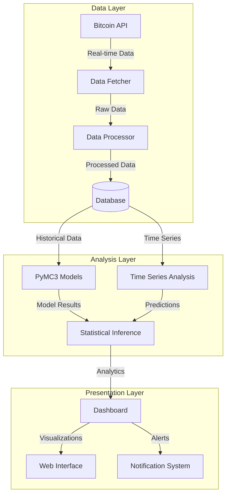
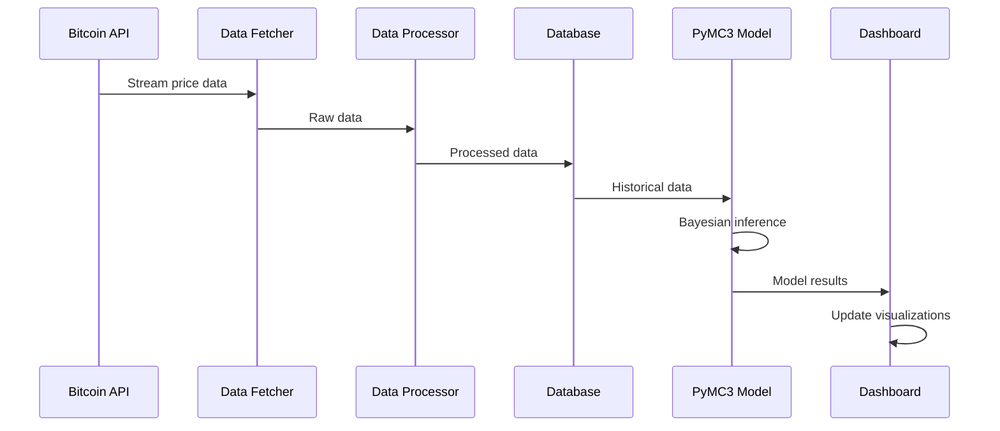
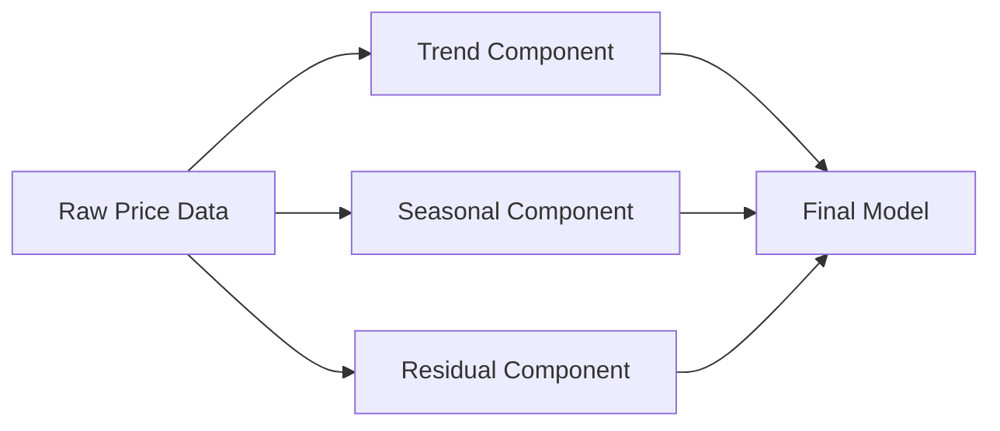

# Real-time Bitcoin Price Analysis Using PyMC3

## 📊 Project Overview

This project implements a sophisticated real-time Bitcoin price analysis system using PyMC3 for Bayesian inference and statistical modeling. The system fetches live Bitcoin price data, performs advanced statistical analysis, and provides insights through interactive visualizations.

## 🎯 Key Features

- Real-time Bitcoin price data fetching and processing
- Bayesian statistical modeling using PyMC3
- Time series analysis and price prediction
- Interactive data visualization dashboard
- Automated price alerts and notifications
- Historical data analysis and pattern recognition
- Model performance evaluation and diagnostics

## 🏗️ Project Structure

```
📦 bitcoin-price-analysis
 ┣ 📂 src
 ┃ ┣ 📂 data
 ┃ ┃ ┣ 📜 data_fetcher.py      # Bitcoin price data acquisition
 ┃ ┃ ┣ 📜 data_processor.py    # Data cleaning and preprocessing
 ┃ ┃ ┗ 📜 database.py          # Database operations
 ┃ ┣ 📂 models
 ┃ ┃ ┣ 📜 bayesian_model.py    # PyMC3 model definitions
 ┃ ┃ ┣ 📜 time_series.py       # Time series analysis
 ┃ ┃ ┗ 📜 predictive.py        # Price prediction models
 ┃ ┣ 📂 visualization
 ┃ ┃ ┣ 📜 dashboard.py         # Interactive dashboard
 ┃ ┃ ┗ 📜 plots.py             # Visualization utilities
 ┃ ┗ 📂 utils
 ┃   ┣ 📜 config.py            # Configuration settings
 ┃   ┗ 📜 helpers.py           # Utility functions
 ┣ 📂 notebooks
 ┃ ┣ 📜 exploration.ipynb      # Data exploration
 ┃ ┗ 📜 analysis.ipynb         # Analysis notebooks
 ┣ 📂 tests
 ┃ ┣ 📜 test_data.py          # Data processing tests
 ┃ ┣ 📜 test_models.py         # Model tests
 ┃ ┗ 📜 test_utils.py          # Utility tests
 ┣ 📂 docs
 ┃ ┣ 📜 api.md                 # API documentation
 ┃ ┗ 📜 models.md              # Model documentation
 ┣ 📜 .env.example             # Environment variables template
 ┣ 📜 .gitignore              # Git ignore rules
 ┣ 📜 requirements.txt         # Project dependencies
 ┣ 📜 setup.py                # Package setup
 ┗ 📜 README.md               # Project documentation
```

## 🔄 System Architecture



## 📈 Data Flow



## 🛠️ Technical Implementation

### Data Collection
- Real-time data fetching using cryptocurrency exchange APIs
- WebSocket connections for live price updates
- Data validation and cleaning pipelines
- Efficient data storage and retrieval system

### Statistical Modeling
The project employs PyMC3 for sophisticated Bayesian modeling:

```python
import pymc3 as pm

def create_price_model(data):
    with pm.Model() as model:
        # Prior for volatility
        σ = pm.HalfNormal('σ', sd=1)
        
        # Prior for mean return
        μ = pm.Normal('μ', mu=0, sd=1)
        
        # Price change likelihood
        returns = pm.Normal('returns', mu=μ, sd=σ, observed=data)
        
        # Sampling
        trace = pm.sample(2000, tune=1000, return_inferencedata=False)
    
    return model, trace
```

### Time Series Components



## 📊 Visualization Components

The dashboard includes:
1. Real-time price charts
2. Bayesian inference plots
3. Prediction intervals
4. Model diagnostics
5. Performance metrics

## 🚀 Getting Started

### Prerequisites
- Python 3.8+
- PyMC3
- Pandas
- Plotly
- NumPy

### Installation

```bash
# Clone the repository
git clone https://github.com/yourusername/bitcoin-price-analysis.git

# Create virtual environment
python -m venv venv
source venv/bin/activate  # On Windows: venv\Scripts\activate

# Install dependencies
pip install -r requirements.txt
```

### Configuration
1. Copy `.env.example` to `.env`
2. Add your API keys and configuration settings
3. Adjust model parameters in `config.py`

## 📈 Usage Examples

```python
from src.data.data_fetcher import BitcoinDataFetcher
from src.models.bayesian_model import PriceModel

# Initialize data fetcher
fetcher = BitcoinDataFetcher()

# Get real-time data
data = fetcher.get_latest_prices()

# Create and run model
model = PriceModel(data)
results = model.analyze()

# Generate visualizations
model.plot_results()
```

## 🔍 Model Diagnostics

The system includes comprehensive model diagnostics:
- MCMC convergence checks
- Prior and posterior predictive checks
- Model comparison metrics
- Residual analysis

## 📝 Documentation

Detailed documentation is available in the `docs` directory:
- API Reference
- Model Specifications
- Configuration Guide
- Troubleshooting Guide

## 🧪 Testing

```bash
# Run all tests
pytest

# Run specific test suite
pytest tests/test_models.py
```

## 🤝 Contributing

1. Fork the repository
2. Create your feature branch
3. Commit your changes
4. Push to the branch
5. Create a Pull Request

## 📄 License

This project is licensed under the MIT License - see the LICENSE file for details.

## 👥 Authors

- Your Name - Initial work

## 🙏 Acknowledgments

- PyMC3 development team
- Bitcoin data providers
- Open source community

## 📞 Support

For support and questions, please open an issue in the GitHub repository.

---

**Note**: This project is under active development. Features and documentation may be updated frequently. 