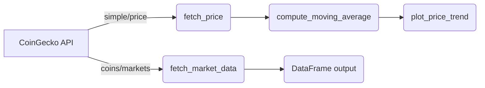

# API Documentation

## 1. Overview of Native CoinGecko API

**Root URL:**
```
https://api.coingecko.com/api/v3
```

**Demo Plan Authentication:**
All requests must include your Demo Plan API key as a query parameter:
```bash
curl https://api.coingecko.com/api/v3/ping?x_cg_demo_api_key=YOUR_API_KEY
```

We leverage two primary endpoints:
- `/simple/price` → retrieves current price for one or more coins.  
- `/coins/markets` → returns a full market data snapshot, including price, market cap, volume, and 24 h statistics.

---

## 2. Why a Python Wrapper Layer?

**Intent & Benefits:**
- **Abstraction**: Hide HTTP details (URL formation, key injection).  
- **Consistency**: Uniform error handling (`raise_for_status`, missing fields).  
- **Convenience**: Return pandas DataFrames ready for analysis, rather than raw JSON.

**Key Design Decisions:**
- Use `requests` for HTTP calls, because of its simplicity and reliability.  
- Normalize JSON into flat DataFrames, converting ISO date strings into `pd.Timestamp`.  
- Provide plotting utilities that work out of the box with the returned DataFrames.

---

## 3. Wrapper Functions in `XYZ_utils.py`

| Function                  | Intent                                      | Key Design Decisions                                         |
|---------------------------|---------------------------------------------|--------------------------------------------------------------|
| `fetch_price`            | Get current price for a single coin         | Uses `/simple/price`, injects API key if provided; returns a 1-row DataFrame with timestamped price.  |
| `fetch_market_data`      | Get comprehensive market snapshot           | Hits `/coins/markets`, flattens JSON to DataFrame; parses date fields.                                 |
| `compute_moving_average` | Smooth price history via rolling window     | Leverages `df.rolling(window).mean()`; appends `ma_{window}` column.                                   |
| `plot_price_trend`       | Visualize price & moving average over time  | Uses Matplotlib; flexible on whether to include MA curve.                                            |


### 3.1. Usage Examples

```python
import utils as api

# 1. Fetch latest price
df_price = api.fetch_price(
    coin_id="bitcoin",
    vs_currency="usd",
    api_key="YOUR_API_KEY"
)

# 2. Compute 20-period moving average
df_ma = api.compute_moving_average(df_price, window=20)

# 3. Plot price with MA overlay
api.plot_price_trend(df_ma, price_col="price", ma_col="ma_20")
```

```python
# Fetch full market data
df_market = api.fetch_market_data(
    coin_id="bitcoin",
    vs_currency="usd",
    api_key="YOUR_API_KEY"
)
# Inspect key fields
print(df_market[['current_price', 'market_cap', 'total_volume', 'high_24h', 'low_24h']])
```

---

## 4. Architecture Diagram




---

## 5. Docker & Kubernetes Integration Notes

- **Dockerfile** packages `utils.py` and installs dependencies (`requests`, `pandas`, `matplotlib`).
- Environment variables or build args can inject `API_KEY` at runtime.

```dockerfile
ARG DEMO_API_KEY
ENV DEMO_API_KEY=${DEMO_API_KEY}
COPY utils.py /app/
RUN pip install requests pandas matplotlib
```

- **Kubernetes Deployment** example snippet:

```yaml
apiVersion: apps/v1
kind: Deployment
metadata:
  name: bitcoin-fetcher
spec:
  replicas: 2
  template:
    spec:
      containers:
      - name: fetcher
        image: bitcoin-pipeline:latest
        env:
        - name: DEMO_API_KEY
          valueFrom:
            secretKeyRef:
              name: coingecko-key
              key: api_key
```

For full cluster setup, autoscaling, and monitoring (Prometheus/Grafana), see the project README.

