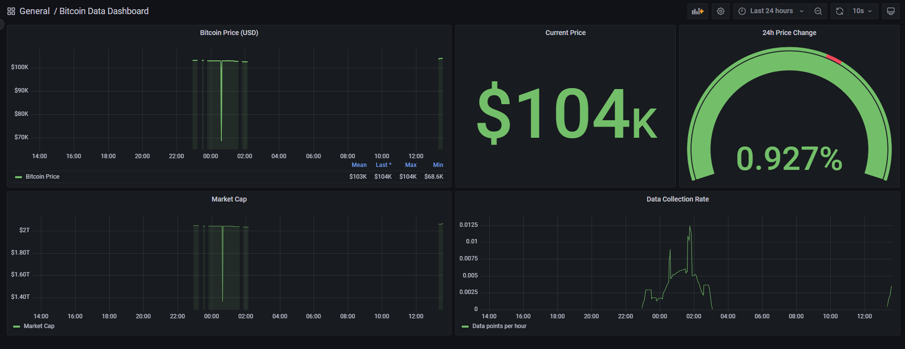
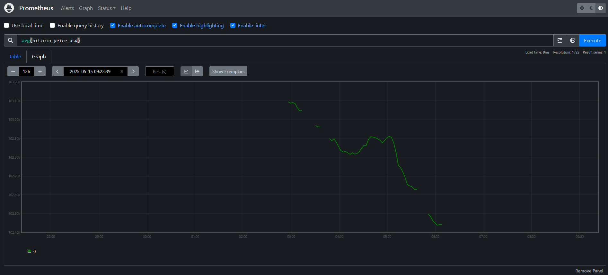

# Kubernetes Bitcoin Data Processing System

A scalable Kubernetes-based system for processing real-time Bitcoin data with automatic scaling, monitoring, and analytics capabilities.


## Project Overview

This project implements a comprehensive system for fetching, storing, analyzing, and visualizing Bitcoin price data using Kubernetes as the orchestration platform. It provides real-time price monitoring, historical data analysis, time-series forecasting, and anomaly detection, all within a scalable and resilient infrastructure.

### Key Features

- Real-time Bitcoin data ingestion from CoinGecko API
- Persistent storage in PostgreSQL database
- Automatic horizontal scaling based on load
- Time-series forecasting using ARIMA modeling
- Anomaly detection for unusual price movements
- Comprehensive monitoring with Prometheus and Grafana
- Trading signal generation based on price analysis

## Repository Structure

```
bitcoin-k8s-project/
├── dashboards/               # Grafana dashboard configurations
├── docker/                   # Docker configurations
│   ├── Dockerfile
│   └── requirements.txt
├── kubernetes/               # Kubernetes manifests
│   ├── deployment.yaml
│   ├── service.yaml
│   ├── configmap.yaml
│   ├── hpa.yaml
│   ├── postgres-*.yaml
│   └── prometheus/
│       └── ...
├── src/                      # Source code
│   ├── bitcoin_data_fetcher.py
│   ├── db_manager.py
│   ├── advanced_analytics.py
│   └── utils.py
├── setup/                    # Setup scripts
│   ├── minikube-setup.sh
│   └── generate-secrets.sh
├── data/                     # Data directories for persistence
│   ├── prometheus/
│   └── postgres/
├── documentation/            # Documentation files
│   ├── Kubernetes_Bitcoin.API.md
│   ├── Kubernetes_Bitcoin.API.ipynb
│   ├── Kubernetes_Bitcoin.example.md
│   ├── Kubernetes_Bitcoin.example.ipynb
│   └── Kubernetes_Bitcoin_utils.py
├── .env.secrets.example      # Example secrets configuration
├── .gitignore                # Git ignore file
└── README.md                 # This file
```

## Getting Started

### Prerequisites

- Docker
- Kubernetes cluster (Minikube for local development)
- kubectl configured to work with your cluster
- Python 3.9+

### Installation

1. Clone this repository:
   ```bash
   git clone https://github.com/yourusername/bitcoin-k8s-project.git
   cd bitcoin-k8s-project
   ```

2. Set up your secrets:
   ```bash
   cp .env.secrets.example .env.secrets
   # Edit .env.secrets to set your secure passwords
   ```

3. Create data directories for persistence:
   ```bash
   mkdir -p data/prometheus
   mkdir -p data/postgres
   ```

4. Run the setup script:
   ```bash
   chmod +x setup/generate-secrets.sh
   chmod +x setup/minikube-setup.sh
   
   # Generate secrets from your .env.secrets file
   ./setup/generate-secrets.sh
   
   # Start Minikube and deploy the application
   ./setup/minikube-setup.sh
   ```

5. Set up data persistence:
   ```bash
   # In separate terminal windows:
   minikube mount ./data/prometheus:/data/prometheus
   minikube mount ./data/postgres:/data/postgres
   ```

### Initial Database Setup

If the database tables don't exist after deployment, manually create them:

```bash
# Get the PostgreSQL pod name
POSTGRES_POD=$(kubectl get pods -l app=postgres -o jsonpath="{.items[0].metadata.name}")

# Connect to PostgreSQL and create the table
kubectl exec -it $POSTGRES_POD -- psql -U postgres -d bitcoin_data -c "
CREATE TABLE IF NOT EXISTS bitcoin_data (
    id SERIAL PRIMARY KEY,
    timestamp TIMESTAMP NOT NULL,
    price_usd FLOAT NOT NULL,
    market_cap_usd FLOAT,
    volume_24h_usd FLOAT,
    price_change_24h FLOAT
);

CREATE INDEX IF NOT EXISTS idx_bitcoin_timestamp ON bitcoin_data(timestamp);
"
```

### Accessing Services

After successful deployment, access the services:

1. **Grafana Dashboard**:
   ```bash
   minikube service grafana --url
   ```
   Default credentials: admin / admin

2. **Prometheus**:
   ```bash
   minikube service prometheus --url
   ```

3. **Check Bitcoin Fetcher logs**:
   ```bash
   kubectl logs -l app=bitcoin-fetcher --max-log-requests=10
   ```

4. **View stored data**:
   ```bash
   kubectl exec -it $POSTGRES_POD -- psql -U postgres -d bitcoin_data -c "SELECT * FROM bitcoin_data ORDER BY timestamp DESC LIMIT 10;"
   ```

## Running the Documentation Notebooks

The repository includes Jupyter notebooks that demonstrate the system's capabilities. These notebooks use mock data for demonstration purposes and do not require connection to the actual Kubernetes services.

1. Navigate to the documentation directory:
   ```bash
   cd documentation
   ```

2. Start Jupyter notebook server:
   ```bash
   jupyter notebook
   ```

3. Open the following notebooks:
   - `Kubernetes_Bitcoin.API.ipynb`: Demonstrates the API usage
   - `Kubernetes_Bitcoin.example.ipynb`: Shows a complete example application

The notebooks are self-contained and can be executed from top to bottom without external dependencies.

## Project Components

### Core Infrastructure Components

1. **Bitcoin Fetcher**: Periodically fetches Bitcoin price data from the CoinGecko API, processes it, and stores it in PostgreSQL.

2. **PostgreSQL Database**: Stores historical Bitcoin price data for analysis and retrieval.

3. **Prometheus**: Collects metrics from all components for monitoring and alerting.

4. **Grafana**: Provides visualization dashboards for Bitcoin price data and system metrics.

5. **Horizontal Pod Autoscaler**: Automatically scales the Bitcoin Fetcher deployment based on CPU and memory usage.

### Documentation Components

1. **Kubernetes_Bitcoin.API.md**: Documents the native API and our software layer built on top of it.

2. **Kubernetes_Bitcoin.API.ipynb**: Jupyter notebook demonstrating usage of both the native API and our wrapper layer.

3. **Kubernetes_Bitcoin.example.md**: Presents a complete example application (BitAlert) built on our API layer.

4. **Kubernetes_Bitcoin.example.ipynb**: Jupyter notebook demonstrating the BitAlert application end-to-end.

5. **Kubernetes_Bitcoin_utils.py**: Python module containing utility functions for interacting with our API.

## Maintenance

### Stopping the System

To stop the system temporarily:
```bash
minikube stop
```

### Restarting the System

To restart after stopping:
```bash
minikube start

# Restart mount commands in separate terminals
minikube mount ./data/prometheus:/data/prometheus
minikube mount ./data/postgres:/data/postgres
```

### Completely Removing the System

To delete everything:
```bash
minikube delete
```

### Updating the System

To update after making changes:
```bash
# Rebuild the Docker image
eval $(minikube docker-env)
docker build -t bitcoin-fetcher:latest -f docker/Dockerfile .

# Restart the deployment
kubectl rollout restart deployment bitcoin-fetcher
```

## Troubleshooting

### Common Issues

1. **Pods stuck in pending state**:
   Check for resource constraints:
   ```bash
   kubectl describe pods
   ```

2. **PostgreSQL connection failures**:
   Verify PostgreSQL is running:
   ```bash
   kubectl get pods -l app=postgres
   kubectl logs $(kubectl get pods -l app=postgres -o jsonpath='{.items[0].metadata.name}')
   ```

3. **Metrics not showing in Grafana**:
   Check Prometheus target status:
   ```bash
   kubectl port-forward svc/prometheus 9090:9090
   ```
   Then access http://localhost:9090/targets in your browser.

4. **Data persistence issues after restart**:
   Ensure mount commands are running and volumes are properly connected:
   ```bash
   kubectl describe pods | grep -A 10 Volumes
   ```

### Kubernetes Bitcoin Dashboard (Grafana):

**Note:** The gaps in the graph denote when the servers were inactive/stopped 

### Kubernetes Bitcoin Dashboard (Prometheus):

**Note:** The gaps in the graph denote when the servers were inactive/stopped 

---

Created by Serjius Infanto - 2025