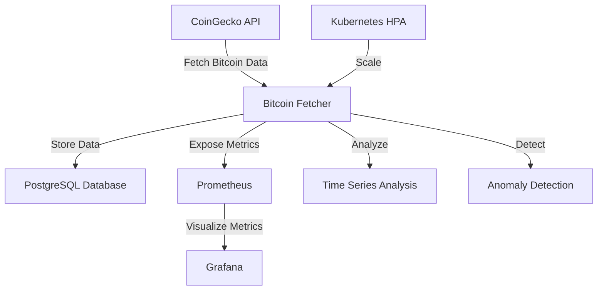

# Kubernetes_Bitcoin API Documentation

## Overview

This document provides detailed information about the Kubernetes Bitcoin data processing system's API components. The system is designed to fetch real-time Bitcoin data, process it through a Kubernetes-orchestrated pipeline, and provide both storage and visualization capabilities.

## Architecture

The system consists of the following components:



## Native API: CoinGecko

The system uses the CoinGecko API as the primary data source for Bitcoin price information.

### Base Endpoint
```
https://api.coingecko.com/api/v3
```

### Key Endpoints Used

1. **Simple Price Endpoint**
   ```
   /simple/price?ids=bitcoin&vs_currencies=usd&include_market_cap=true&include_24hr_vol=true&include_24hr_change=true
   ```
   Returns current Bitcoin price data, including market cap, 24-hour volume, and 24-hour price change.

### CoinGecko API Response Format

```json
{
  "bitcoin": {
    "usd": 60000.0,
    "usd_market_cap": 1200000000000.0,
    "usd_24h_vol": 35000000000.0,
    "usd_24h_change": 2.5
  }
}
```

## Software Layer API

Our software layer provides several components that interact with the native API and extend its functionality:

### 1. Bitcoin Data Fetcher

The core component that interfaces with the CoinGecko API.

#### Key Functions

- `fetch_bitcoin_data()`: Retrieves the latest Bitcoin data from CoinGecko
- `process_and_store_data(data)`: Processes and stores data in PostgreSQL
- `create_visualizations()`: Generates visual representations of the data

### 2. Database Manager

Handles all interactions with the PostgreSQL database.

#### Key Methods

- `insert_bitcoin_data(timestamp, price_usd, market_cap_usd, volume_24h_usd, price_change_24h)`: Stores Bitcoin data
- `get_recent_bitcoin_data(hours=24)`: Retrieves recent data for a specified time period
- `get_price_statistics(hours=24)`: Calculates statistical summaries of price data

### 3. Advanced Analytics

Provides time-series analysis and anomaly detection capabilities.

#### Key Functions

- `perform_time_series_analysis(data_df)`: Applies ARIMA modeling for price forecasting
- `detect_price_anomalies(data_df, contamination=0.05)`: Identifies unusual price movements

### 4. Prometheus Metrics

Exposes application metrics for monitoring and alerting.

#### Key Metrics

- `bitcoin_price_usd`: Current Bitcoin price in USD
- `bitcoin_market_cap_usd`: Current market capitalization
- `bitcoin_volume_24h_usd`: 24-hour trading volume
- `bitcoin_price_change_24h`: 24-hour price change percentage
- `bitcoin_fetcher_requests_total`: Total API requests made
- `bitcoin_fetcher_requests_failed`: Failed API requests
- `bitcoin_request_duration_seconds`: API request duration histogram
- `bitcoin_data_points_stored_total`: Count of data points stored
- `bitcoin_anomalies_detected_total`: Count of detected price anomalies

## Database Schema

The system uses a PostgreSQL database with the following schema:

### Bitcoin Data Table

```
bitcoin_data (
    id SERIAL PRIMARY KEY,
    timestamp TIMESTAMP NOT NULL,
    price_usd FLOAT NOT NULL,
    market_cap_usd FLOAT,
    volume_24h_usd FLOAT,
    price_change_24h FLOAT
)
```

Indexes:
- `idx_bitcoin_timestamp` on `timestamp` for efficient time-based queries

## Utility Wrappers

The system includes utility wrappers that simplify interaction with the core components:

### Data Retrieval

```python
def get_bitcoin_price_history(days=7):
    """
    Retrieve Bitcoin price history for the specified number of days.
    
    Args:
        days (int): Number of days of history to retrieve
        
    Returns:
        pandas.DataFrame: DataFrame containing timestamp and price_usd columns
    """
    # Implementation details
```

### Analysis Utilities

```python
def forecast_bitcoin_price(hours_ahead=12):
    """
    Generate a forecast of Bitcoin price for the specified number of hours ahead.
    
    Args:
        hours_ahead (int): Number of hours to forecast
        
    Returns:
        dict: Dictionary containing forecast values and confidence intervals
    """
    # Implementation details
```

### Monitoring Utilities

```python
def get_system_health():
    """
    Retrieve the current health status of the system components.
    
    Returns:
        dict: Dictionary containing health status of each component
    """
    # Implementation details
```

## Kubernetes Integration

The system leverages Kubernetes for orchestration and scaling:

### Horizontal Pod Autoscaler (HPA)

The Bitcoin fetcher is configured with HPA to automatically scale based on resource utilization:

```yaml
apiVersion: autoscaling/v2
kind: HorizontalPodAutoscaler
metadata:
  name: bitcoin-fetcher-hpa
spec:
  scaleTargetRef:
    apiVersion: apps/v1
    kind: Deployment
    name: bitcoin-fetcher
  minReplicas: 1
  maxReplicas: 5
  metrics:
  - type: Resource
    resource:
      name: cpu
      target:
        type: Utilization
        averageUtilization: 80
```

## Error Handling

All API interactions include error handling to manage potential issues:

1. **Network Errors**: Retries with exponential backoff
2. **API Rate Limiting**: Respects rate limits and waits when necessary
3. **Data Validation**: Validates responses before processing
4. **Database Connectivity**: Handles connection issues gracefully

## Authentication and Security

- Database credentials are stored as Kubernetes secrets
- API keys (if required) are stored securely and not exposed in code
- All components communicate over secure internal networks

## Extending the API

To extend the API with additional functionality:

1. Add new methods to the appropriate component (e.g., `DatabaseManager` for new data queries)
2. Expose new metrics in the `bitcoin_data_fetcher.py` file for monitoring
3. Create additional Grafana dashboards to visualize new metrics
4. Update the Kubernetes configurations to include any new components

## Usage Examples

For practical examples of using this API, refer to the following resources:

- `Kubernetes_Bitcoin.example.md`: Complete application example
- `Kubernetes_Bitcoin.example.ipynb`: Jupyter notebook with end-to-end functionality
- `Kubernetes_Bitcoin_utils.py`: Utility functions for interacting with the API
