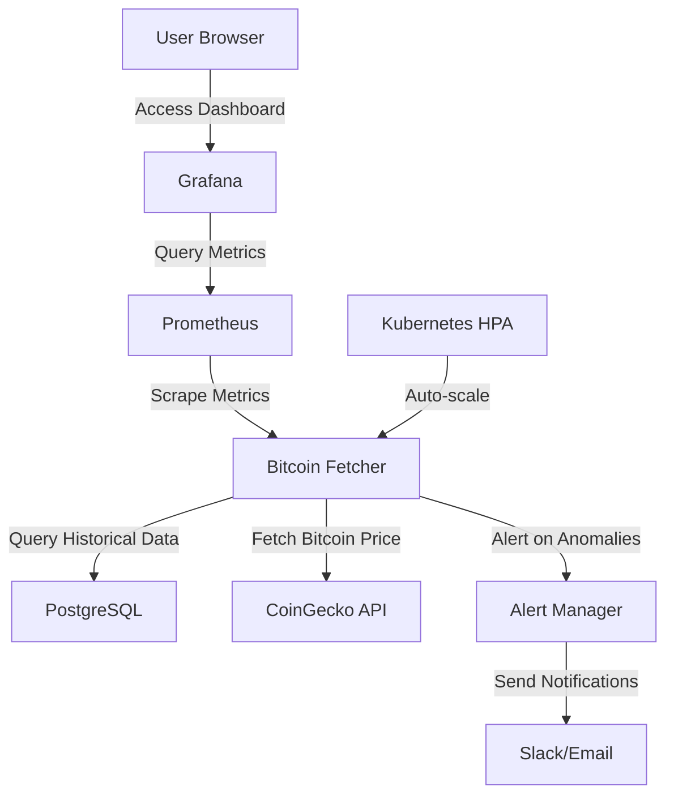

# Kubernetes_Bitcoin Example

This document presents a complete example of an application that uses the Kubernetes Bitcoin data processing system. We'll walk through a real-world scenario where we build a Bitcoin price monitoring and alerting dashboard that helps traders make informed decisions.

## Application Overview

Our application, **BitAlert**, is a Bitcoin price monitoring dashboard that:

1. Displays real-time Bitcoin price data
2. Shows historical price trends and market metrics
3. Forecasts future price movements
4. Detects price anomalies and sends alerts
5. Monitors system health and scales automatically under load

## Architecture

BitAlert leverages the Kubernetes Bitcoin infrastructure to provide these features:



## Implementation Steps

### 1. Setting Up the Core Infrastructure

The first step is to deploy the Kubernetes Bitcoin infrastructure using the setup script:

```bash
# Generate secrets from environment variables
./setup/generate-secrets.sh

# Deploy the infrastructure
./setup/minikube-setup.sh
```

This sets up:
- PostgreSQL for data storage
- Bitcoin fetcher for data collection and analysis
- Prometheus for metrics collection
- Grafana for visualization
- Horizontal Pod Autoscaler for automatic scaling

### 2. Configuring the BitAlert Dashboard

Once the infrastructure is running, we create a custom Grafana dashboard for BitAlert that displays:

- Current Bitcoin price with 24-hour change
- Historical price chart with trend indicators
- Market cap and trading volume metrics
- Price forecast for next 12 hours
- Anomaly detection alerts
- System health metrics

The dashboard is created using the Grafana API with our utility functions:

```python
import Kubernetes_Bitcoin_utils as kb

# Create the BitAlert dashboard
dashboard_id = kb.create_bitalert_dashboard()
print(f"BitAlert dashboard created with ID: {dashboard_id}")
```

### 3. Setting Up Anomaly Alerts

Next, we configure alert rules in Prometheus to notify users when price anomalies are detected:

```python
# Configure anomaly alerts
alert_rule = {
    "name": "BitcoinPriceAnomaly",
    "expr": "bitcoin_anomalies_detected > 0",
    "for": "1m",
    "labels": {
        "severity": "warning"
    },
    "annotations": {
        "summary": "Bitcoin price anomaly detected",
        "description": "Bitcoin price has shown unusual movement detected by the anomaly detection algorithm"
    }
}

# Create the alert rule
kb.create_alert_rule(alert_rule)
```

### 4. Implementing Trading Signal Logic

The core of BitAlert is its trading signal logic that analyzes price data and generates buying or selling signals:

```python
def generate_trading_signals():
    # Get recent price data
    recent_data = kb.get_bitcoin_price_history(days=30)
    
    # Get price forecast
    forecast = kb.forecast_bitcoin_price(hours=24)
    
    # Check for anomalies
    anomalies = kb.detect_price_anomalies()
    
    # Generate signals based on data, forecast, and anomalies
    signals = []
    
    # Signal 1: Strong upward trend predicted
    if forecast['trend_direction'] == 'up' and forecast['percent_change_forecast'] > 2.0:
        signals.append({
            'type': 'BUY',
            'strength': 'HIGH',
            'reason': f"Strong upward price trend predicted (Expected {forecast['percent_change_forecast']:.2f}% increase)"
        })
    
    # Signal 2: Strong downward trend predicted
    elif forecast['trend_direction'] == 'down' and forecast['percent_change_forecast'] < -2.0:
        signals.append({
            'type': 'SELL',
            'strength': 'HIGH',
            'reason': f"Strong downward price trend predicted (Expected {forecast['percent_change_forecast']:.2f}% decrease)"
        })
    
    # Signal 3: Anomaly detected
    if anomalies['has_anomaly']:
        if anomalies['z_score'] > 2.0:  # Unusually high price
            signals.append({
                'type': 'SELL',
                'strength': 'MEDIUM',
                'reason': f"Price anomaly detected (unusually high price, Z-score: {anomalies['z_score']:.2f})"
            })
        elif anomalies['z_score'] < -2.0:  # Unusually low price
            signals.append({
                'type': 'BUY',
                'strength': 'MEDIUM',
                'reason': f"Price anomaly detected (unusually low price, Z-score: {anomalies['z_score']:.2f})"
            })
    
    return signals
```

### 5. Building the Web Interface

Finally, we create a web interface that displays the BitAlert dashboard and trading signals:

```python
from flask import Flask, render_template, jsonify
import Kubernetes_Bitcoin_utils as kb

app = Flask(__name__)

@app.route('/')
def index():
    # Get current Bitcoin data
    bitcoin_data = kb.get_current_bitcoin_data()
    
    # Generate trading signals
    signals = generate_trading_signals()
    
    # Get system health
    health = kb.get_system_health()
    
    return render_template('index.html', 
                           bitcoin_data=bitcoin_data,
                           signals=signals,
                           health=health)

@app.route('/api/signals')
def api_signals():
    signals = generate_trading_signals()
    return jsonify(signals)

@app.route('/api/bitcoin/current')
def api_bitcoin_current():
    bitcoin_data = kb.get_current_bitcoin_data()
    return jsonify(bitcoin_data)

if __name__ == '__main__':
    app.run(host='0.0.0.0', port=5000)
```

## Results and Benefits

The BitAlert application demonstrates how to leverage the Kubernetes Bitcoin infrastructure to build a powerful trading assistant:

1. **Real-time Monitoring**: Traders can track Bitcoin price movements in real-time, with historical context to understand trends.

2. **Predictive Insights**: The integrated time-series forecasting helps traders anticipate potential price movements, giving them an edge in the market.

3. **Anomaly Detection**: The system automatically identifies unusual price movements, allowing traders to react quickly to market changes.

4. **Scalability**: The Kubernetes infrastructure scales automatically during periods of high market volatility, ensuring the system remains responsive.

5. **Reliability**: With built-in monitoring and redundancy, the system continues to function even if individual components fail.

## Extending the Application

There are several ways to extend the BitAlert application:

1. **Multi-currency Support**: Extend the system to monitor multiple cryptocurrencies, not just Bitcoin.

2. **Advanced Analytics**: Incorporate additional indicators like RSI, MACD, or Bollinger Bands for more sophisticated trading signals.

3. **Automated Trading**: Connect the system to trading APIs to execute trades automatically based on signals.

4. **Mobile Notifications**: Add push notifications for mobile devices when important signals are generated.

5. **Historical Backtesting**: Add functionality to backtest trading strategies against historical price data.

## Conclusion

This example demonstrates how the Kubernetes Bitcoin infrastructure can serve as a foundation for building powerful, real-world applications. By abstracting away the complexity of data collection, storage, and analysis, developers can focus on building features that provide value to end-users.

The BitAlert application showcases the key strengths of the system:
- Reliable data collection
- Sophisticated analysis
- Automatic scaling
- Comprehensive monitoring
- Easy integration

By using the provided utility functions (`Kubernetes_Bitcoin_utils.py`), developers can quickly build similar applications without needing to understand the underlying Kubernetes infrastructure.
