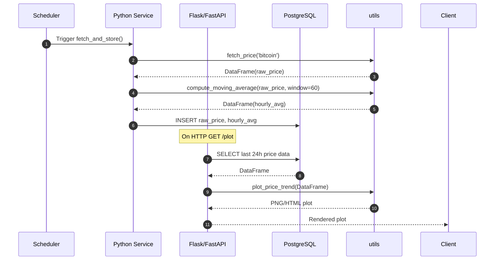

# Example Application

A complete end‑to‑end application that uses the `utils` wrapper to build a real‑time Bitcoin data pipeline:

## Use‑Case Narrative

We want a lightweight service that:
1. **Ingests** the current Bitcoin price every minute.  
2. **Processes** data to compute the past hour’s average price.  
3. **Stores** both raw and averaged values in PostgreSQL for historical analysis.  
4. **Exposes** a simple HTTP endpoint to visualize the last 24 h of prices and averages.

This pipeline can scale horizontally and be scheduled in Kubernetes as a CronJob for reliability.

---

## Component Breakdown

| Component       | Responsibility                                          | Key Function(s)                |
|-----------------|---------------------------------------------------------|--------------------------------|
| **Ingestion**   | Periodically fetch live price                          | `utils.fetch_price()`      |
| **Processing**  | Compute rolling hourly average                          | `utils.compute_moving_average(window=60)` |
| **Storage**     | Persist data into PostgreSQL tables                     | `save_to_db(df, table_name)` (custom wrapper) |
| **Visualization** | Generate on‑demand plot for the past 24 h             | `utils.plot_price_trend()` |
| **Scheduler**   | Trigger ingestion every minute                          | Kubernetes CronJob or `apscheduler`  |
| **API Server**  | Serve HTTP requests with latest plot or data            | Flask/FastAPI app             |


---

## Sequence Diagram



---

## Deployment Hints

### Docker Setup

```bash
# Build container image
docker build -t bitcoin-pipeline:latest .

# Run locally (port 8080)
docker run --rm -e DEMO_API_KEY=$DEMO_API_KEY -p 8080:8080 bitcoin-pipeline:latest
```

Expected output on startup:
```
Starting Bitcoin fetch scheduler (every 1 minute)...
Launching API server on port 8080
```

### Kubernetes CronJob Example

```yaml
apiVersion: batch/v1beta1
kind: CronJob
metadata:
  name: bitcoin-fetcher
spec:
  schedule: "*/1 * * * *"  # every minute
  jobTemplate:
    spec:
      template:
        spec:
          containers:
          - name: fetcher
            image: bitcoin-pipeline:latest
            env:
            - name: DEMO_API_KEY
              valueFrom:
                secretKeyRef:
                  name: coingecko-key
                  key: api_key
          restartPolicy: OnFailure
```

This CronJob ensures the ingestion logic runs reliably every minute. The API server can be deployed as a separate Deployment behind a Service for user access.

---


