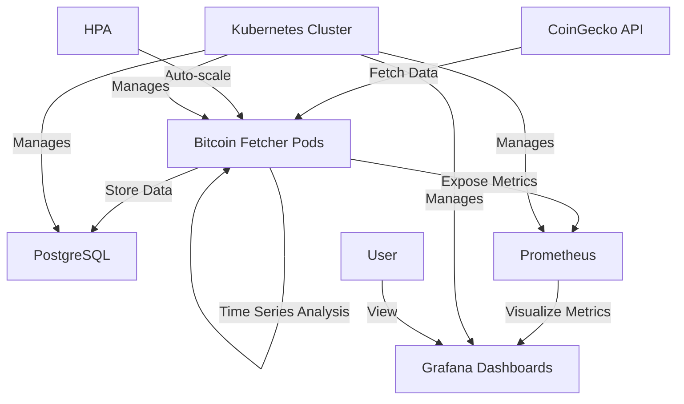

# Bitcoin Data Processing on Kubernetes

A scalable, monitoring-ready Kubernetes application that fetches, processes, and analyzes Bitcoin price data.

## Features

- Real-time Bitcoin data ingestion from CoinGecko API
- PostgreSQL database for reliable data storage
- Advanced time-series analysis with ARIMA modeling and anomaly detection
- Horizontal pod autoscaling for handling load spikes
- Comprehensive monitoring with Prometheus and Grafana
- Production-ready deployment configurations

## Architecture



## Prerequisites

- Docker
- Minikube (or a Kubernetes cluster)
- kubectl
- 4GB+ free memory for Minikube

## Quick Start

1. Clone this repository:
   ```bash
   git clone <repository-url>
   cd bitcoin-k8s-project
   ```

2. Run the setup script:
   ```bash
   chmod +x setup/minikube-setup.sh
   ./setup/minikube-setup.sh
   ```

3. Access Grafana to see the dashboards:
   ```bash
   minikube service grafana --url
   ```
  Check/Update the secret files for the username and password
## Secret Management

This project uses secret files to manage sensitive information. To set up:

1. Copy the example secrets file:
```bash
cp .env.secrets.example .env.secrets
```
2. Edit `.env.secrets` and replace the placeholder values with secure passwords.

3. Generate Kubernetes secret files:
```bash
./setup/generate-secrets.sh
```
4. Run the setup script as normal:
```bash
./setup/minikube-setup.sh
```
**IMPORTANT**: Never commit `.env.secrets` or any generated secret files to the repository!


## Component Details

### Bitcoin Data Fetcher

Responsible for:
- Fetching real-time Bitcoin data from CoinGecko API
- Storing data in PostgreSQL
- Performing time-series analysis and anomaly detection
- Exposing Prometheus metrics

### PostgreSQL Database

Stores:
- Raw Bitcoin price data
- Market capitalization
- Trading volume
- 24-hour price changes
- Analytics results

### Prometheus

Collects metrics:
- API request rates and errors
- Processing duration
- Bitcoin price, market cap, and changes
- System resource usage
- Anomalies detected

### Grafana

Provides dashboards for:
- Bitcoin price trends
- Market metrics
- System performance
- Data collection status

## Advanced Configuration

### Scaling

The application uses Horizontal Pod Autoscaler to automatically scale based on:
- CPU utilization (target: 80%)
- Memory utilization (target: 80%)

Scaling parameters can be modified in `kubernetes/hpa.yaml`.

### Data Retention

By default, PostgreSQL retains all historical data. To configure data retention, you can add the following cron job:

```yaml
apiVersion: batch/v1
kind: CronJob
metadata:
  name: bitcoin-data-cleanup
spec:
  schedule: "0 0 * * *"  # Run daily at midnight
  jobTemplate:
    spec:
      template:
        spec:
          containers:
          - name: db-cleanup
            image: postgres:14
            command:
            - /bin/sh
            - -c
            - PGPASSWORD=$POSTGRES_PASSWORD psql -h postgres -U postgres -d bitcoin_data -c "DELETE FROM bitcoin_data WHERE timestamp < NOW() - INTERVAL '30 days';"
            env:
            - name: POSTGRES_PASSWORD
              valueFrom:
                secretKeyRef:
                  name: postgres-secret
                  key: postgres-password
          restartPolicy: OnFailure
```

## Troubleshooting

### Common Issues

#### Pods stay in pending state
Check for resource constraints:
```bash
kubectl describe pods
```

#### PostgreSQL connection failures
Verify PostgreSQL is running:
```bash
kubectl get pods -l app=postgres
kubectl logs $(kubectl get pods -l app=postgres -o jsonpath='{.items[0].metadata.name}')
```

#### Metrics not showing in Grafana
Check Prometheus target status:
```bash
kubectl port-forward svc/prometheus 9090:9090
```
Then access http://localhost:9090/targets in your browser.

## Project Extensions

Some ideas to extend the project:
- Add more cryptocurrencies
- Implement machine learning predictions
- Set up alerts based on price movements
- Create a web UI to view analytics
- Add a streaming solution like Kafka for higher throughput