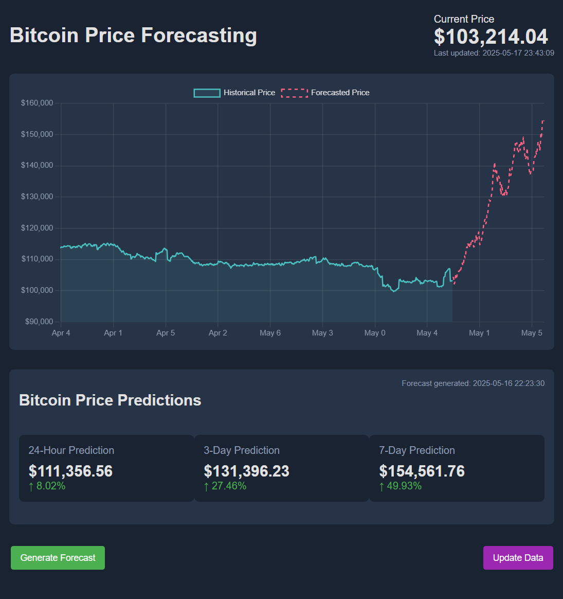

# Real-Time Bitcoin_Data Processing using TensorFlow Extended
## Project Overview

To build a real-time Bitcoin price forecasting system using a full machine learning pipeline powered by TensorFlow Extended (TFX).




### What This Project Does:

* Collects real-time Bitcoin price data from public APIs (like CoinGecko).
* Validates and transforms the data for time series modeling.
* Trains a deep learning model (LSTM) to predict future price trends.
* Serves predictions through both:

  * A Flask dashboard (visual interactive interface)
  * A RESTful API server (machine-accessible endpoints)
* Automatically updates forecasts and retrains the model periodically (hourly or daily).

### Key Outcomes:

* A full end-to-end TFX pipeline for time series forecasting.
* Dockerized setup for easy deployment.
* Real-time dashboard and API interface.
* Automated model retraining and forecast evaluation loop.

## Repository Structure

This repository is organized to separate concerns between data ingestion, transformation, modeling, deployment, and visualization

## Repository Structure

```
├── Dockerfile                  # Docker build configuration
├── docker-compose.yml         # Compose setup for dashboard and API
├── requirements.txt           # Python package dependencies
├── run_all.py                 # One-shot script to run the entire pipeline
├── setup.py                   # Optional environment setup logic
├── tf_pipeline.py             # Defines the TFX pipeline
├── transform.py               # Feature engineering and preprocessing logic
├── trainer.py                 # LSTM model training logic
├── tf_bitcoin_utils.py        # Helper functions for fetching and cleaning Bitcoin data
├── predict.py                 # Forecast generator using trained model
├── realtime_update.py         # Real-time retraining and evaluation loop
├── simple_dashboard.py        # Flask app for visualizing forecasts
├── api_server.py              # REST API to serve real-time and predicted prices
├── simple_deploy.py           # Launches both dashboard and API together
├── data/
│   └── bitcoin/               # Raw historical and real-time price data CSVs
├── forecasts/                 # Saved forecast outputs (CSV + PNG)
├── evaluation/                # Forecast evaluation results
└── tfx_pipeline_output/       # Artifacts and metadata from the TFX pipeline
```
## Architecture Overview

The system architecture integrates data engineering, machine learning, and deployment workflows in a modular and automated pipeline.

### Data Flow and Component Roles:

1. **Data Ingestion**
   - `tf_bitcoin_utils.py` fetches raw Bitcoin price data from public APIs.
   - The data is stored as CSVs in `data/bitcoin/`, forming the basis for ingestion.

2. **Pipeline Definition (TFX)**
   - The pipeline is defined in `tf_pipeline.py`, using TFX components:
     - `CsvExampleGen`: Loads the raw CSV data
     - `StatisticsGen` and `SchemaGen`: Analyze and validate feature schema
     - `ExampleValidator`: Detects anomalies in data
     - `Transform`: Normalizes price data, creates cyclical and volatility features (via `transform.py`)
     - `Trainer`: Trains an LSTM model (via `trainer.py`)
     - `Pusher`: Saves the trained model to `tfx_pipeline_output/`

3. **Model Serving**
   - `api_server.py` loads the latest model and exposes endpoints (`/current`, `/forecast`) for real-time predictions.
   - `simple_dashboard.py` displays current and forecasted prices with visual charts.
   - `simple_deploy.py` runs both services together for convenience.

4. **Retraining and Forecast Automation**
   - `realtime_update.py` runs as a background loop:
     - Periodically fetches new data
     - Triggers retraining via the pipeline
     - Evaluates and logs model performance
     - Generates fresh forecasts (via `predict.py`)

This architecture ensures that the model stays up to date, the data pipeline is reproducible, and forecasts are accessible via both UI and API. It is fully containerized using Docker and compatible with production deployment scenarios.

## Dockerfile Overview

The `Dockerfile` included in this project does the following:

1. **Uses a Python 3.9 base image** for compatibility with TensorFlow and TFX.
2. **Sets the working directory** to `/app`.
3. **Copies the entire project** directory into the container.
4. **Installs Python dependencies** from `requirements.txt`.
5. **Sets the default command** to run `simple_deploy.py`, which starts both the dashboard and API.

### Dockerfile Sample
```dockerfile
FROM python:3.9-slim
WORKDIR /app
COPY . /app
RUN pip install --no-cache-dir -r requirements.txt
CMD ["python", "simple_deploy.py"]
```

---

## How to Build and Run

### Step 1: Build the Docker Image
From the project root directory, run:
```bash
docker build -t bitcoin-dashboard .
```

### Step 2: Run the Docker Container
```bash
docker run -p 5000:5000 -p 5001:5001 bitcoin-dashboard
```

- Port 5000: Flask dashboard for visualizing forecasts.
- Port 5001: RESTful API server for accessing real-time predictions.

### Step 3: Access the Interfaces

- Dashboard: http://localhost:5000
- API Server: http://localhost:5001

Both services remain active while the container is running.

---

## Optional: Docker Compose

If you're using `docker-compose.yml`, you can launch everything more easily.

### Start Services
```bash
docker-compose up --build
```

### Stop Services
```bash
docker-compose down
```

## Troubleshooting

### Docker Container Issues

- **Container won't start**
  - Make sure ports `5000` (dashboard) and `5001` (API) are not already in use.
  - Try stopping other containers or services using those ports:
    ```bash
    docker ps
    docker stop <container_id>
    ```

- **Changes not reflecting in the container**
  - You may need to rebuild the image:
    ```bash
    docker build -t bitcoin-dashboard .
    ```

---

### Forecast Not Displaying

- **Blank dashboard or no forecast data**
  - Ensure forecasts have been generated. Run:
    ```bash
    python realtime_update.py
    ```
  - Confirm that forecast files exist in the `forecasts/` directory (both `.csv` and `.png`).

- **Graph loads but doesn’t update**
  - This may happen if old model output is cached. Remove `forecasts/` and regenerate:
    ```bash
    rm -rf forecasts/*
    python realtime_update.py
    ```

---

### Model or Pipeline Errors

- **TFX pipeline fails to run**
  - Check that your data is in `data/bitcoin/bitcoin_prices.csv` and properly formatted.
  - Make sure the virtual environment or Docker image has all dependencies:
    ```bash
    pip install -r requirements.txt
    ```

- **Trainer fails with shape mismatch**
  - Ensure your lag features and sequence length are consistent in both `transform.py` and `trainer.py`.

---

### API Issues

- **API returns 500 error**
  - Confirm that a model has been pushed to `tfx_pipeline_output/`.
  - If missing, re-run the pipeline:
    ```bash
    python tf_pipeline.py
    ```

- **API returns empty list**
  - Most likely caused by empty or malformed forecast output.
  - Regenerate predictions:
    ```bash
    python predict.py
    ```

---

If issues persist, try rebuilding the project from scratch:
```bash
docker-compose down
docker system prune -a
docker-compose up --build


## Accessing Model and Forecast Data Inside Docker Container

### 1. Accessing the Running Docker Container

To access the running Docker container and inspect the model or forecast data:

1. **Find the container ID or name**:
   Run the following to list all running containers:
   ```bash
   docker ps
   ```

2. **Access the container interactively**:
   ```bash
   docker exec -it <container_name_or_id> /bin/bash
   ```

   Replace `<container_name_or_id>` with the actual name or ID from the `docker ps` output.

3. **Navigate to the model directory**:
   The trained model is stored in the `/app/tfx_pipeline_output/bitcoin_price_pipeline/serving_model/` directory. Once inside the container, navigate there using:
   ```bash
   cd /app/tfx_pipeline_output/bitcoin_price_pipeline/serving_model/
   ```

4. **List model files**:
   You should see files like `saved_model.pb` and a `variables/` directory. To list the contents, run:
   ```bash
   ls
   ```

5. **Access forecast data**:
   The forecast data is stored in the `/app/forecasts/` directory. You can navigate there with:
   ```bash
   cd /app/forecasts/
   ls
   ```

---

### 2. Copying Files from the Container to the Host

To copy the model or forecast files from the container to your local machine, use the `docker cp` command.

#### Copy the model directory to the host:
```bash
docker cp <container_id>:/app/tfx_pipeline_output/bitcoin_price_pipeline/serving_model ./serving_model
```

#### Copy the forecast data directory to the host:
```bash
docker cp <container_id>:/app/forecasts ./forecasts
```

This will copy the files and directories from the container to your current working directory on the host machine.

---

### 3. Helpful Directory Structure

- **Model Files**: `/app/tfx_pipeline_output/bitcoin_price_pipeline/serving_model/`
- **Forecast Data**: `/app/forecasts/`
- **Raw Data**: `/app/data/bitcoin/`

