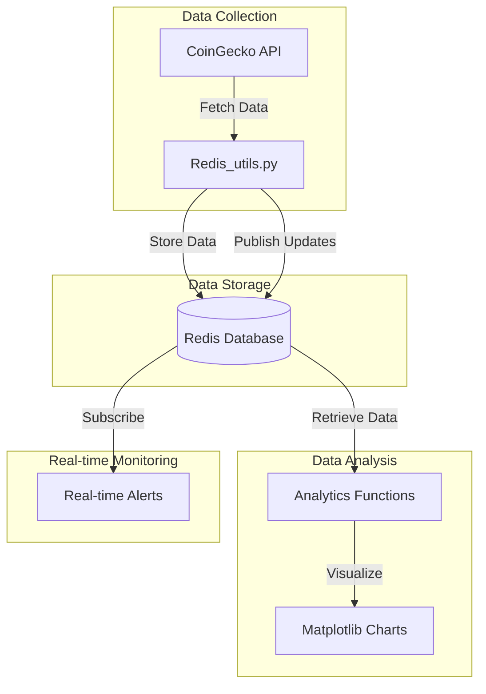

# Real-time Bitcoin Price Analytics with Redis

A system for collecting, storing, analyzing, and visualizing Bitcoin price data in real-time using Redis.

## 1. Project Structure

### Files and Components

- **Redis_utils.py**: Core utility module with Redis operations, data fetching and analytics functions.
- **Redis.API.ipynb**: Documentation and demonstration of Redis API features used in the project.
- **Redis.example.ipynb**: Complete implementation example showing data fetching, storage, analysis and visualization.
- **Redis.API.md**: Documentation of the native Redis API and custom wrapper layer built for Bitcoin analytics.
- **Redis.example.md**: Project overview and architectural explanation with code samples.
- **docker_data605_style/**: Docker configuration for containerized deployment.

### System Architecture



### Redis Database Schema

The project uses several Redis data structures to store different types of information:

| Key Pattern | Type | Description | Example |
|-------------|------|-------------|--------|
| `bitcoin:current_price:{currency}` | String | Current Bitcoin price | `bitcoin:current_price:usd` → `45000.25` |
| `bitcoin:data:{currency}` | Hash | Complete current price data | `bitcoin:data:usd` → {price, market_cap, volume_24h, ...} |
| `bitcoin:price_history:{currency}` | Sorted Set | Time series of price data | Score: timestamp, Value: JSON data |
| `bitcoin:price:history:{currency}` | Sorted Set | Simple price history | Score: timestamp, Value: price |
| `bitcoin:last_updated` | String | Timestamp of last update | Unix timestamp |
| `bitcoin_price_updates` | Pub/Sub Channel | Real-time price updates | Messages with price data |

## 2. Setup and Run Instructions

### Prerequisites

- Python 3.0+
- Docker and Compose installed
- Redis Database Instance credentials

### Setup

#### project Setup

1. Clone this repository:
   ```bash
   git clone [repository-url]
   cd ~/tutorials1/DATA605/Spring2025/projects/TutorTask163_Spring2025_Real-Time_Bitcoin_Price_Analytics_with_Redis$ 
   ```

2. Create a `.env` file for Redis connection:
   ```bash
   # Redis connection parameters - Using local Redis (pre-Docker workflow)
   REDIS_HOST=localhost
   REDIS_PORT=6379
   REDIS_PASSWORD=
   ```

   > **Note:** 
   > - For local development, install Redis on your machine first: https://redis.io/docs/getting-started/
   > - On most systems, Redis runs on localhost:6379 without a password by default
   > - If you have your own Redis instance (like Redis Cloud), use those credentials instead

3. Build and activate the thin environment:
   ```bash
   # Build the thin environment (done once per client)
   cd ~/src/tutorials1/helpers_root
   ./dev_scripts_helpers/thin_client/build.py
   
   # Activate the thin environment (do this every time you work on the project)
   source ~/src/tutorials1/dev_scripts_tutorials/thin_client/setenv.sh
   ```
   
   > **Note:** Make sure the thin environment is always activated when working with this project.
   
   If you see output like below, your environment is successfully built!
   
   ```
   ...   
   alias sp='echo \'source ~/.profile\''; source ~/.profile'
   alias vi='/usr/bin/vi'
   alias vim='/usr/bin/vi'
   alias vimdiff='/usr/bin/vi -d'
   alias vip='vim -c "source ~/.vimrc_priv"'
   alias w='which'
   ==> SUCCESS <==
   ```


#### Docker Setup

1. Navigate to the docker configuration directory:
   ```bash
   cd docker_data605_style
   ```

2. Build the Docker image:
   ```bash
   ./docker_build.sh
   ```

3. Run the container with Jupyter and Redis:
   ```bash
   ./docker_jupyter.sh
   ```

   This will:
   - Start a container with Redis and Jupyter Lab
   - Mount your project files into the container
   - Expose Jupyter on port 8888
   - Expose Redis on port 6379
   - Set up persistent storage for Redis data

### Running the Project

#### Using Jupyter Notebooks

1. Start Jupyter Lab:
   - using Docker: Navigate to `http://localhost:8888` in your browser

2. Open `Redis.example.ipynb` to run the complete implementation example, which includes:
   - Connecting to Redis
   - Fetching current and historical Bitcoin prices
   - Storing data in Redis
   - Analyzing price data with various metrics
   - Visualizing price trends and patterns
   - Setting up real-time price alerts


### Expected Results

After running the notebook or command-line tools, you should see:

1. Bitcoin price data stored in Redis
2. Time series visualization of price trends
3. Price statistics including moving averages and volatility
4. Anomaly detection highlighting unusual price movements
5. Real-time price alerts when thresholds are crossed