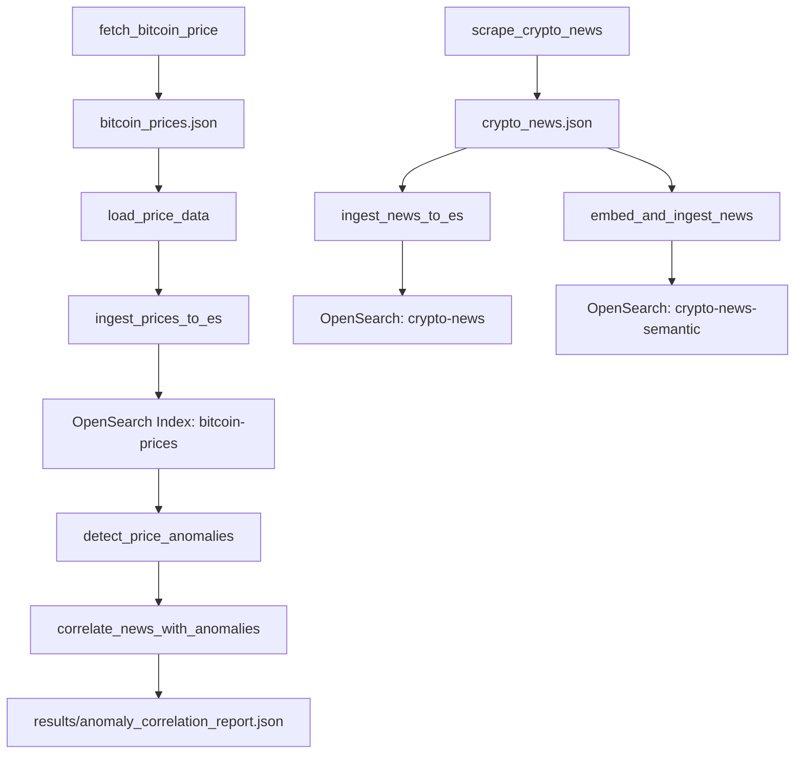

# Bitcoin API Layer – `bitcoin_utils.py`

This markdown documents the API functionality implemented in `bitcoin_utils.py` – a wrapper module that interfaces with CoinGecko, CryptoPanic, and OpenSearch.

---

## Purpose

The goal of this utility module is to:

* Isolate reusable logic for price fetching, news scraping, ingestion, and semantic correlation
* Provide clean building blocks for notebooks (`.ipynb`) to use declaratively
* Abstract the raw APIs (CoinGecko, OpenSearch, CryptoPanic) into friendly Python methods

---

## Architecture



---

## Function List

### `get_es_client()`

Returns a ready OpenSearch client (no auth, localhost).

---

### `fetch_bitcoin_price()`

Uses `pycoingecko` to fetch real-time BTC price and timestamp.
Returns:

```python
{'timestamp': '2025-05-14T18:05:00', 'price': 97563.42}
```

---

### `load_price_data(path)`

Loads line-delimited JSON, parses timestamps, computes `% change`, and returns a cleaned DataFrame.

---

### `ingest_prices_to_es(df)`

* Creates index `bitcoin-prices` with timestamp, price, pct\_change
* Prevents re-ingestion of existing timestamps
* Bulk ingests new data

---

### `scrape_crypto_news(api_key, seen_urls, output_path)`

* Fetches news from CryptoPanic
* Filters duplicates using `seen_urls`
* Appends to output JSON file

---

### `ingest_news_to_es(news_path, index_name)`

* Creates `crypto-news` index
* Parses line-delimited JSON and bulk indexes all articles

---

### `embed_and_ingest_news(news_path, index_name)`

* Uses `sentence-transformers` to embed news titles
* Creates `crypto-news-semantic` index with `dense_vector`
* Ingests article + vector to enable semantic search

---

### `detect_price_anomalies(price_df, threshold=5)`

* Groups price data by date
* Flags spikes/drops where % change > threshold (default 5%)
* Returns anomaly DataFrame

---

### `correlate_news_with_anomalies(anomalies)`

* For each anomaly:

  * Searches `crypto-news` in ±1 day window
  * If `crypto-news-semantic` exists, uses cosine similarity to rank top 3 news
* Returns a list of:

```json
{
  "timestamp": "2025-05-10",
  "pct_change": -7.41,
  "top_news": ["SEC lawsuit targets major exchange", "Bitcoin tumbles amid crackdown"]
}
```

---

## Summary

This API file allows students and developers to:

* Work with large-scale time series and text data
* Use modern LLM-based embeddings
* Abstract raw API logic into declarative building blocks
* Enable Kibana dashboards via OpenSearch indexing

> Designed to power both data engineering and LLM retrieval workflows
