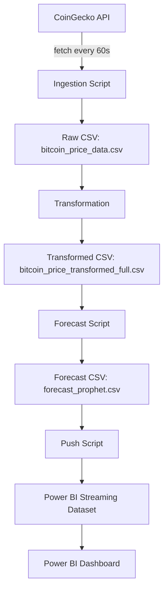

# Real-Time Bitcoin Data Ingestion & Analysis Pipeline

**Author:** Abhishek Rithik Origanti  
**Date:** May 2025  
**Course:** DATA 605 – Big Data Systems  
**Instructor:** Prof. Giovanni Saggesse

## 📌 Project Overview

This project implements a full-stack pipeline to fetch, transform, forecast and visualize live Bitcoin price data:

1. **Data Ingestion**  
   - A Python script polls the CoinGecko API every 60 seconds and appends raw price & market-cap records to a CSV.  

2. **Transformation**  
   - Raw data is converted into a "full history" CSV with timestamp parsing, percent-change, 7-point moving average, and 15-point rolling volatility.  

3. **Forecasting & Decomposition**  
   - A secondary script runs both Prophet and SARIMA forecasts for the next 60 minutes, saves them to CSV, and produces a seasonal-decompose plot.  

4. **Real-Time Dashboard**  
   - A "push" script reads the latest forecast CSV and streams the new data into a Power BI streaming dataset.  
   - The Power BI report connects to that dataset and displays:  
     - Current price  
     - 7-point moving average  
     - Volatility  
     - Percent change  
     - Forecasted future trend  

## 📂 File Descriptions

| File | Purpose |
|------|---------|
| `bitcoin_data_ingestion.py` | Polls CoinGecko, appends raw data to `bitcoin_price_data.csv` |
| `bitcoin_utils.py` | Fetch + store helper and `transform_bitcoin_data()` to build `*_full.csv` |
| `bitcoin_price_data.csv` | Raw ingestion log (timestamp, price_usd, market_cap_usd) |
| `bitcoin_price_transformed_full.csv` | Full history with `price_change_pct`, `moving_avg_price`, `volatility_15m` |
| `bitcoin_example.py` | Runs Prophet & SARIMA forecasts and seasonal decomposition, outputs forecast CSVs and PNG |
| `forecast_prophet.csv` | Prophet forecast + rolling metrics |
| `push_to_powerbi.py` | Reads `forecast_prophet.csv` and streams rows into Power BI (or prints JSON) |
| `docker-compose.yml` | Defines three services: ingestion, forecast, push |
| `requirements.txt` | Python dependencies |
| `README.md` | This document |
| `Real-Time_Bitcoin_Dashboard.pbix` | Power BI Desktop report, configured for streaming dataset |

## 🚀 Step-by-Step Usage

1. **Activate your Python environment**  
   ```bash
   cd ~/src/tutorials1/DATA605/Spring2025/projects/TutorTask174_Spring2025_Real-Time_Bitcoin_Data_Ingestion_and_Time_Series_Analysis_using_Microsoft_Power_BI_5
   source venv/bin/activate
2. **Install dependencies**
   ```bash
   pip install -r requirements.txt # or, at minimum: pip install pandas prophet statsmodels matplotlib requests
3. **Run ingestion**
   ```bash
   python bitcoin_data_ingestion.py
Fetches new data every 60s into bitcoin_price_data.csv.

4. **Transform & enrich data**
   ```bash
   python - <<EOF
   from bitcoin_utils import transform_bitcoin_data
   transform_bitcoin_data(
   input_file='bitcoin_price_data.csv',
   output_file='bitcoin_price_transformed_full.csv'
   )
   EOF

5. **Generate forecasts & decomposition**
   ```bash
   python bitcoin_example.py

6. **Preview JSON payload (dry-run)**
   
   In push_to_powerbi.py, set DRY_RUN = True.
   ```bash
   python push_to_powerbi.py

7. **Push to Power BI**

    Set DRY_RUN = False in push_to_powerbi.py.

   ```bash
   python push_to_powerbi.py


  You should see "Pushed X rows to Power BI."

8. **Open & present dashboard**
   - Publish or open `Real-Time_Bitcoin_Dashboard.pbix` in Power BI Service.
   - Confirm visuals use **Average** summarization and display current metrics and forecasts.

## 🐳 Docker Compose Demo
You can run the entire real-time ingestion → forecast → push pipeline locally via Docker Compose.

## Architecture Flowchart


1. **Build and start all services**
   ```bash
   docker compose up --build

 This will:
- **btc_ingestion**: continuously fetch live Bitcoin data every 60 s  
- **btc_forecast**: run Prophet/SARIMA forecasts once on the latest data  
- **btc_push**: push the forecast rows (with `moving_avg_price` and `volatility_15m`) to your Power BI streaming dataset  

2. **Stop the demo**  
   Press <kbd>Ctrl</kbd>+<kbd>C</kbd> in the terminal to stop the ingestion loop (forecast and push exit automatically).

3. **Tear everything down**  
   To remove all containers and the network, run:
   ```bash
   docker compose down

```bash
docker compose down
```
## 🎯 Future Work

- Integrate additional cryptocurrencies (e.g., Ethereum).  
- Add LSTM-based forecasting for deep-learning insights.  
- Implement real-time alerts for anomalous volatility via Microsoft Teams.  
- Extend static CSV refresh with Power BI Dataflows for historical analysis.  


