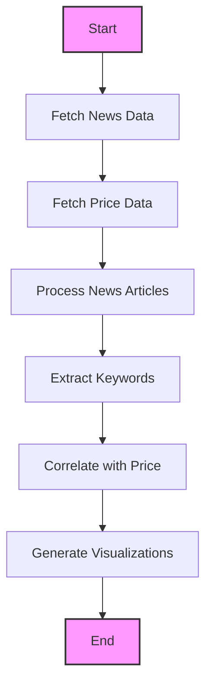
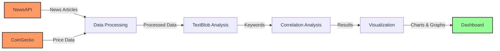
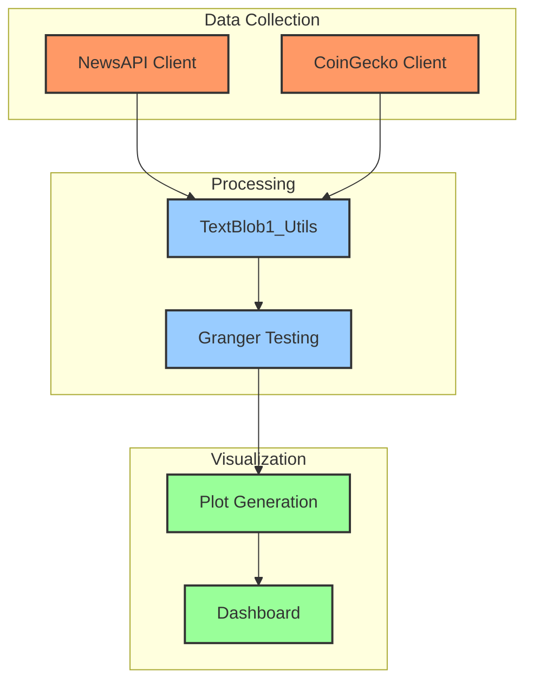

# Bitcoin News Keyword Trend Analysis

This project analyzes Bitcoin-related news articles to identify trending keywords and correlate their frequency with Bitcoin price movements over time. It leverages TextBlob for natural language processing and provides both statistical analysis and interactive visualizations.

## Features

- **News Data Collection**: Fetches Bitcoin-related news articles from NewsAPI
- **Keyword Extraction**: Extracts and analyzes meaningful keywords from articles
- **Price Data Integration**: Incorporates Bitcoin price data from CoinGecko API
- **Correlation Analysis**: Identifies relationships between keywords and price movements
- **Interactive Visualization**: Provides visualizations of analysis results

## Project Structure

```
├── main.py                # Main script to run the complete analysis pipeline
├── granger.py            # Granger causality testing implementation
├── TextBlob1_Utils.py    # Utility functions for data processing and analysis
├── TextBlob1.example.md  # Example usage documentation
├── TextBlob1.example.ipynb  # Example Jupyter notebook
├── TextBlob1.API.ipynb   # API documentation notebook
├── TextBlob.API.md       # API documentation
├── requirements.txt      # Python dependencies
├── .dockerignore        # Docker ignore file
├── .gitignore          # Git ignore file
├── data/               # Directory for storing data files
├── figures/            # Directory for storing visualizations
├── dashboard/          # Directory for dashboard files
└── Dockerfile         # Container definition for Docker deployment
```

## Visual Documentation

### Project Workflow



### Data Flow



### Component Interaction



## Analysis Pipeline

1. **Data Collection**: 
   - Fetches Bitcoin-related news articles from NewsAPI
   - Retrieves Bitcoin price data from CoinGecko

2. **Keyword Extraction**:
   - Uses TextBlob to process article text
   - Extracts and ranks important keywords
   - Filters out common stopwords and irrelevant terms

3. **Correlation Analysis**:
   - Correlates keyword frequencies with Bitcoin price movements
   - Identifies keywords with strong price relationships
   - Analyzes temporal patterns in keyword usage

4. **Visualization**:
   - Generates time-series charts of keyword frequencies vs. price
   - Creates correlation visualizations
   - Provides interactive plots for exploration

## Setup and Installation

### Prerequisites

- Python 3.9+
- NewsAPI key (get one at [newsapi.org](https://newsapi.org/))

### Option 1: Standard Installation

1. Clone this repository
2. Install dependencies:
   ```bash
   pip install -r requirements.txt
   ```
3. Create a `.env` file in the project root with your API key:
   ```
   NEWSAPI_KEY=your_news_api_key
   ```

### Option 2: Docker Installation

1. Clone this repository
2. Create a `.env` file as described above
3. Build the Docker image:
   ```bash
   docker build -t bitcoin-news-analysis .
   ```
4. Run the container:
   ```bash
   docker run -d --name bitcoin-analysis -p 8888:8888 -v ${PWD}:/app bitcoin-news-analysis
   ```

## Usage

### Running in Docker with Jupyter Notebook

1. Start the Docker container:
   ```powershell
   docker run -d --name bitcoin-analysis -p 8888:8888 -v ${PWD}:/app bitcoin-news-analysis
   ```

2. Get the Jupyter Notebook URL:
   ```powershell
   docker logs bitcoin-analysis
   ```
   Look for a URL that looks like: `http://127.0.0.1:8888/tree?token=<some_token>`

3. Open the URL in your web browser

4. Navigate to and open `TextBlob1.example.ipynb` to run the complete analysis pipeline

The example notebook contains all the necessary code to:
- Fetch Bitcoin news articles
- Extract keywords
- Analyze correlations with price
- Generate visualizations

### Running Individual Components

You can also run individual components in the Jupyter notebook:

```python
import TextBlob1_Utils as utils

# Fetch news data
news_data = utils.fetch_bitcoin_news(days=30, query='bitcoin OR cryptocurrency', language='en')

# Extract keywords
keywords_df = utils.extract_keywords(news_data)

# Analyze correlations
correlation_df = utils.analyze_keyword_price_correlation(keywords_df, price_data)

# Create visualizations
utils.plot_keyword_trends(keywords_df, price_data, top_n=5)
utils.plot_keyword_correlation(correlation_df, top_n=10)
```

## Example Output

The analysis provides:

1. Sentiment analysis results showing market sentiment trends
2. Top keywords extracted from news articles
3. Correlation analysis between keywords and price movements
4. Interactive visualizations of trends and relationships

## API Rate Limits and Sample Data

If you don't have a NewsAPI key or exceed the API rate limits, the program will automatically use sample data for demonstration purposes.

## License

This project is licensed under the MIT License - see the LICENSE file for details.

## Acknowledgments

- [TextBlob](https://textblob.readthedocs.io/) for NLP capabilities
- [NewsAPI](https://newsapi.org/) for news data
- [CoinGecko](https://www.coingecko.com/en/api) for price data
- [Plotly](https://plotly.com/) for visualizations 