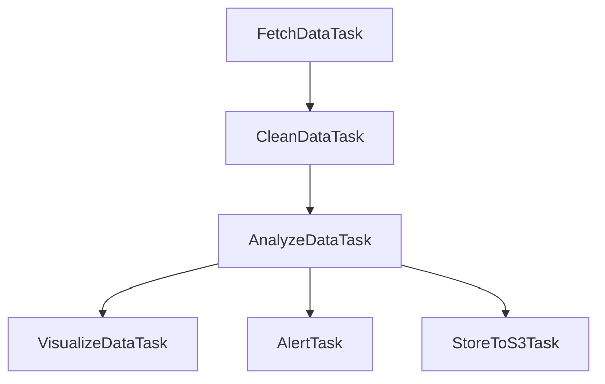

# 📈 Real-Time Bitcoin Analysis Using Luigi
**DATA605 Final Project – Harshitha Murali**  
**UID:** 121302984

---

## 📌 Project Summary

This project is a real-time, modular, and fault-tolerant data pipeline for Bitcoin price analytics.  
It collects data using the Coingecko API, performs time series analysis with ARIMA, detects statistical anomalies, generates visualizations, and delivers alerts via email.  
Results are archived in AWS S3, and the entire project is orchestrated using Luigi and containerized using Docker.

---

## 🎯 Objectives

- Ingest real-time Bitcoin price data
- Forecast future prices using ARIMA
- Detect anomalies using Z-score thresholding
- Visualize price behavior and forecasting errors
- Send email alerts when anomalies are detected
- Upload output to S3 cloud storage
- Build a Luigi-powered pipeline that can run via CLI or Docker

---

## 🧱 Project Structure

```
.
├── coingecko_utils.py           # All Luigi task classes + utility functions
├── coingecko.API.ipynb          # Demonstrates raw Coingecko API usage
├── coingecko.example.ipynb      # Runs full Luigi pipeline and shows output
├── Dockerfile                   # Container setup to run full pipeline
├── requirements.txt             # All Python dependencies
├── .env                         # Your environment config (NOT pushed to Git)
├── .env.example                 # Template for your .env file
├── data/                        # All generated outputs (auto-created)
├── README_FINAL.md              # This documentation
```

---

## 🛠️ Technologies Used

| Tool/Library     | Purpose                                     |
|------------------|---------------------------------------------|
| **Luigi**         | DAG-based task orchestration and scheduling |
| **Coingecko API** | Public BTC price API without auth needed    |
| **pandas**        | Data wrangling and formatting               |
| **statsmodels**   | ARIMA time series forecasting               |
| **matplotlib**    | Plotting price/forecast/anomalies           |
| **boto3**         | Uploading results to AWS S3                 |
| **smtplib**       | Sending email alerts on anomalies           |
| **python-dotenv** | Secure credential loading from .env         |
| **Docker**        | Build/run project in a clean container      |

---

## 🔁 Luigi Task Pipeline (DAG)



---

## 🧩 Luigi Tasks Overview

### `FetchDataTask`
- Fetches hourly BTC-USD price data from Coingecko (past 2 days)
- Output: `raw_<date>.json`

### `CleanDataTask`
- Cleans and sorts timestamps, ensures price column is float
- Output: `clean_<date>.csv`

### `AnalyzeDataTask`
- Calculates rolling volatility
- Builds and applies ARIMA(2,1,2) model
- Calculates Z-score and flags anomalies (`abs(zscore) > 3`)
- Output: `analyzed_<date>.csv`

### `VisualizeDataTask`
- Generates 4 separate PNGs:
    - Price + Forecast + Anomalies
    - 1-Hour Rolling Volatility
    - Forecast Error
    - Z-Score Histogram

### `AlertTask`
- Checks for `anomaly == True`
- If any, sends an email with timestamps
- Logs alert to `alert_<date>.txt`

### `StoreToS3Task`
- Uploads `analyzed_<date>.csv` to your AWS S3 bucket
- Logs confirmation to `uploaded_<date>.txt`

---

## 🧪 Setup Instructions

### 🔹 1. Clone the Repository

```bash
git clone <your-repo-url>
cd bitcoin_price
```

### 🔹 2. Create a Virtual Environment

```bash
python3 -m venv venv
source venv/bin/activate
pip install -r requirements.txt
```

### 🔹 3. Setup Your `.env` File

```bash
cp .env.example .env
```

Then fill in your AWS and email credentials:

```env
AWS_ACCESS_KEY_ID=your-key
AWS_SECRET_ACCESS_KEY=your-secret
S3_BUCKET=your-bucket-name
AWS_REGION=us-east-1

ALERT_EMAIL_FROM=your_email@gmail.com
ALERT_EMAIL_PASSWORD=your_app_password
ALERT_EMAIL_TO=receiver_email@example.com
```

> 🛡️ Never push `.env` to GitHub — it's ignored by `.gitignore`.

---

## ▶️ Running the Pipeline Locally

Make sure your environment is active and `.env` loaded:

```bash
export $(cat .env | xargs)
python -m luigi --module coingecko_utils StoreToS3Task --date 2025-05-18 --local-scheduler
```

Luigi will:
- Pull data
- Forecast + analyze
- Trigger alerts
- Upload to S3
- Save plots and logs under `/data`

---

## 🐳 Running via Docker

### 🔹 1. Build the Docker Image

```bash
docker build -t btc-pipeline .
```

### 🔹 2. Run the Container

```bash
docker run --rm -v $(pwd):/app btc-pipeline
```

> ✅ This auto-loads `.env`, runs the Luigi pipeline, and exits.

---

## 📊 Visual Output Gallery

Plots saved under `/data/plot_*.png` include:
1. **Price vs Forecast + Anomalies**
2. **Rolling Volatility**
3. **Z-score Histogram**
4. **Forecast Error Over Time**

---

## 📬 Email Alerts

If anomalies are found:
- Email sent to `$ALERT_EMAIL_TO`
- Subject: `🚨 BTC Alert for <date>`
- Body: Anomalous timestamps
- File: `alert_<date>.txt` also saved

---

## ☁️ AWS S3 Output

Final file `analyzed_<date>.csv` is uploaded to:

```
s3://<your-bucket>/bitcoin/analytics/analyzed_<date>.csv
```

You'll also get:
```
uploaded_<date>.txt
```

---

## ✅ Final Notes

- All tasks are reproducible and testable in isolation.
- Only one line (`StoreToS3Task`) needs to be run — Luigi handles dependencies.
- Everything is containerized for deployment.

---

## 🙋‍♀️ Maintainer

**Harshitha Murali**  
UID: 121302984  
Project: *Real-Time Bitcoin Analysis Using Luigi*  
Course: **DATA605 – Spring 2025**
