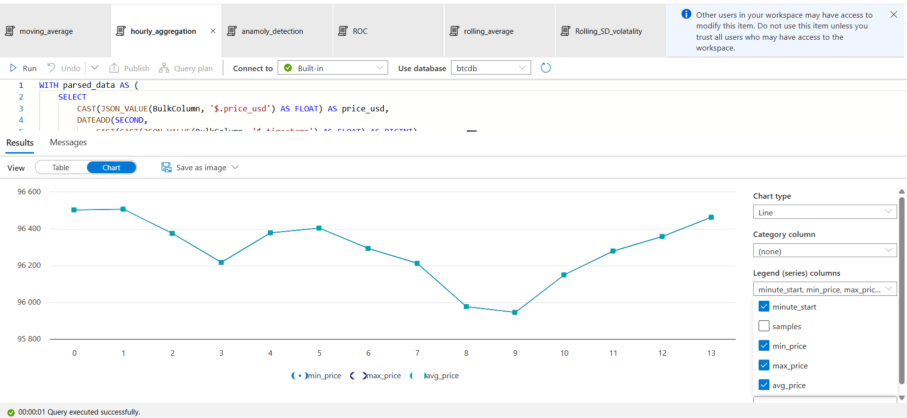

# Tutorial Template: Two Docker Approaches

- This directory provides two versions of the same tutorial setup to help you
  work with Jupyter notebooks and Python scripts inside Docker environments

- Both versions run the same code but use different Docker approaches, with
  different level of complexity and maintainability

## 1. `data605_style` (Simple Docker Environment)

- This version is modeled after the setup used in DATA605 tutorials
- This template provides a ready-to-run environment, including scripts to build,
  run, and clean the Docker container.

- For your specific project, you should:
  - Modify the Dockerfile to add project-specific dependencies
  - Update bash/scripts accordingly
  - Expose additional ports if your project requires them

## 2. `causify_style` (Causify AI dev-system)

- This setup reflects the approach commonly used in Causify AI dev-system
- **Recommended** for students familiar with Docker or those wishing to explore a
  production-like setup
- Pros
  - Docker layer written in Python to make it easy to extend and test
  - Less redundant since code is factored out
  - Used for real-world development, production workflows
  - Used for all internships, RA / TA, full-time at UMD DATA605 / MSML610 /
    Causify 
- Cons
  - It is more complex to use and configure
  - More dependencies from the 
- For thin environment setup instructions, refer to:  
  [How to Set Up Development on Laptop](https://github.com/causify-ai/helpers/blob/master/docs/onboarding/intern.set_up_development_on_laptop.how_to_guide.md)

## Reference Tutorials

- The `tutorial_github` example has been implemented in both environments for you
  to refer to:
  - `tutorial_github_data605_style` uses the simpler DATA605 approach
  - `tutorial_github_causify_style` uses the more complex Causify approach

- Choose the approach that best fits your comfort level and project needs. Both
  are valid depending on your use case.

# Real-Time Bitcoin Streaming & Analysis with Azure and Docker

This project demonstrates a real-time Bitcoin price streaming pipeline using Python, Azure services, and Docker. It ingests data from CoinGecko, streams to Azure Event Hub, stores it in Azure Blob Storage, and performs time series analysis in Azure Synapse and Python notebooks.

---

## What It Does

- Fetches live Bitcoin price data every 60 seconds
- Streams events to Azure Event Hub
- Buffers and stores events in Azure Blob Storage
- Performs time-series analysis (rolling average, MACD, anomalies)
- Runs everything inside a reproducible Docker container

---

## Tech Stack

- Python + Azure SDK (Event Hub, Blob Storage)
- Azure Synapse Analytics
- Docker + PowerShell
- Jupyter Notebook
- CoinGecko API

---

## How to Run

See [docker_instructions.md](./docker_instructions.md) for full setup and commands.

---

## Full Project Walkthrough

For detailed documentation, screenshots, architecture, and code breakdown:  
[project_walkthrough.md](./project_walkthrough.md)

---

## Sample Output

