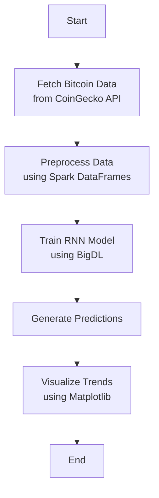

# Real-Time Bitcoin Data Processing with BigDL

## 🚀 Overview

This project leverages **BigDL**, a distributed deep learning library built on **Apache Spark**, to build a real-time Bitcoin price prediction pipeline. It combines data ingestion, distributed processing, and deep learning using an RNN to analyze trends and make predictions.

---

## 🧠 Technologies Used

### 📊 BigDL
- Deep learning library integrated with Apache Spark.
- Enables scalable model training and inference across clusters.

### 🔥 Apache Spark
- Used for distributed data ingestion and transformation via Spark DataFrames.

### 🧾 CoinGecko API
- Real-time data source for Bitcoin prices.

### 🧮 Matplotlib
- Used for generating plots of historical and predicted trends.

---

## 📦 Core Functionalities

1. **Data Ingestion**  
   Pull real-time Bitcoin prices using the CoinGecko API and parse responses.

2. **ETL Processing**  
   Use Spark DataFrames to clean, transform, and window the time series.

3. **RNN Model Training**  
   Create and train a recurrent neural network (RNN) using BigDL to detect patterns.

4. **Prediction & Visualization**  
   Use trained models to predict future prices and visualize them with Matplotlib.

---

## 📂 Project Structure

| File                | Purpose                                      |
|---------------------|----------------------------------------------|
| `Bitcoin_pipeline.py` | Main driver script                          |
| `Bitcoin_API.py`      | Module to interact with the CoinGecko API  |
| `requirements.txt`    | Dependency list                            |
| `Dockerfile`          | Docker image for running project (optional) |

---


---

## 📊 Pipeline Diagram (Live Mermaid)

You can explore the real-time editable flowchart here:

🔗 [Click to open Mermaid Chart](https://www.mermaidchart.com/app/projects/5373cd39-f84c-4dea-a47d-48802de5f28e/diagrams/e97200d7-4e93-4a95-87aa-18660446908c/version/v0.1/edit)


## ⚙️ Setup & Installation

### Option 1: Local Python Environment

```bash
pip install --pre bigdl-spark -f https://developer.intel.com/ipex-whl-stable
pip install pyspark requests matplotlib
