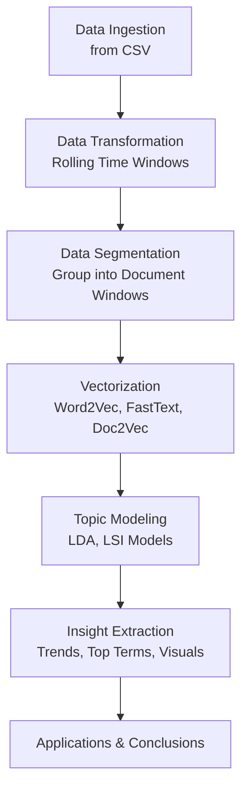

**Real-Time Bitcoin Data Processing with Gensim**

*By: Sagar Maheshwari*

**Description**
The project focuses on using Gensim, a powerful Python library to analyze real-time Bitcoin data. Gensim is popular for natural language processing (NLP) tasks, specifically for topic modeling, document similarity, and word embedding. This project will explore Gensim's capabilities in processing time-series data, and students will apply its functionalities to perform complex analyses on Bitcoin price trends. The objective is to ingest real-time Bitcoin data using standard Python packages, transform it using Gensim to draw insights, and implement time-series analysis.

**Technology**
Gensim: Gensim is a robust library designed primarily for topic modeling and document similarity analysis using NLP. Key features include training word2vec, doc2vec models, and creating topic models using Latent Dirichlet Allocation (LDA). Although Gensim isn't commonly associated with time-series data, its vector space modeling can be ingeniously adapted for this purpose.

**Key Functionalities**:
- Topic modeling using LDA and LSI
- Creating document vectors using Doc2Vec
- Word Embedding using Word2Vec and FastText
- Efficient Similarity Queries

**Use in this Project**:
- Transform time-series data (Bitcoin prices) into vector space representation
- Identify trends or emerging patterns as "topics" in dataset
- Use cosine similarity to compare different time periods

**Project Description**
- Data Ingestion:
Use Python’s requests or websockets to fetch real-time Bitcoin data from APIs such as CoinGecko or Binance.
- Data Transformation:
Pre-process the time-series data to convert Bitcoin price changes into a suitable format for analysis
Segment data into suitable time intervals (e.g., 5-minute windows)
- Vectorization:
Use Gensim to transform each data segment into a vector
Analyze these vectors to infer trends, highlighting price volatilities or significant market shifts
- Analysis:
Model the "topics" that are indicative of price dynamics
Use similarity measures to find analogous price movement periods
- Outcome:
Provide comprehensive insights into Bitcoin pricing trends over time

**Useful Resources**
- [Gensim Documentation](https://radimrehurek.com/gensim/)
- [Gensim Tutorials and Examples](https://radimrehurek.com/gensim/auto_examples/index.html)
- [CoinGecko API Documentation](https://www.coingecko.com/en/api)
- [Binance API Documentation](https://binance-docs.github.io/apidocs/spot/en/)

**Is it Free?**
Yes, Gensim is an open-source library that is completely free to use. Data collection through APIs like CoinGecko or Binance is generally free, though they might have rate limits or require registration for API keys.

**Python Libraries / Bindings**
- Gensim: Primary library for modeling and analysis. Installable via pip install gensim.
- NumPy and SciPy: For numerical computing and any mathematical operations required. Installable with pip install numpy scipy.
- Pandas: Used for data manipulation and transforming API response into an analyzable format. Install with pip install pandas.
- Requests or Websockets: Used for making HTTP requests to API endpoints or establishing WebSocket connections for real-time data. Install using pip install requests or pip install websockets.

---


# Bitcoin Topic Modeling & Analysis Using Gensim

This project walks through an end-to-end Natural Language Processing (NLP) pipeline applied to Bitcoin-related data. Using **Gensim**, it performs **vectorization**, **topic modeling**, and generates insights on evolving crypto narratives. The pipeline was implemented in a Jupyter Notebook and follows structured stages for reproducibility and extensibility.

---

## Full Pipeline Overview



---

## 1. Importing Modules

The notebook begins by importing core libraries:

- `pandas` for data manipulation
- `matplotlib` for plotting
- `gensim` for NLP and topic modeling
- Custom module `gensim_utils` containing helper functions

> Ensures modularity and code reuse for tasks like vectorization and model training.

---

## 2. Data Ingestion

- Data is pre-loaded using `pandas.read_csv()` from `data.csv`
- Originally intended to be fetched from **CoinGecko API**
- Content includes historical Bitcoin metadata and descriptions

```python
df = pd.read_csv("data.csv")
```

> This CSV acts as a simulated feed of real-time crypto news/data.

---

## 3. Data Transformation & Segmentation

### Data Transformation

- A custom `data_transform(df, window=5)` function is used to apply rolling windows
- Each segment includes multiple records grouped into one document

```python
df = data_transform(df, window=5)
```

> The rolling window groups temporal information into units for semantic analysis.

### Segmentation

- Documents are created using `segmentation(df)`
- These are fed into NLP models

```python
documents = segmentation(df)
```

> Each document simulates a weekly snapshot of crypto news.

---

## 4. Vectorization

### Word2Vec

- Learns distributed representations of words based on context
- Helps find semantically similar terms

```python
w2v_model = word2vec(documents)
```

### FastText

- Extends Word2Vec by considering character-level n-grams
- Handles out-of-vocabulary and rare crypto-specific terms

```python
ft_model = fasttext(documents)
```

### Doc2Vec

- Learns document-level embeddings
- Supports similarity comparison of different time windows

```python
tagged_docs = doc_tagger(documents)
d2v_model = do2vec(tagged_docs)
```

> These vector models allow semantic exploration of the dataset at word and document levels.

---

## 5. Topic Modeling

Topic modeling helps uncover **latent themes** in the crypto text data.

### LDA (Latent Dirichlet Allocation)

- Probabilistic model to extract topic distributions over documents
- Topics are distributions over words

```python
dictionary, corpus = corpus_creation(documents)
lda = lda_modeling(dictionary, corpus)
```

### LSI (Latent Semantic Indexing)

- Uses Singular Value Decomposition (SVD) to extract topics
- Captures deeper co-occurrence semantics

```python
lsi = lsi_modeling(dictionary, corpus)
```

> Both models reveal key terms and groupings that evolve over time.

---

## 6. Insight Extraction

### Examples of Analysis:

#### Bitcoin Price Over Time

```python
plt.plot(df["date"], df["price"])
plt.title("Bitcoin Price Over Time")
```

#### Topic-Term Charts

- Visualize top contributing terms for each topic
- Analyze how often each topic appears in a window

#### Similarity Analysis

- Compare vector similarity between windows
- Detect sudden topic shifts (e.g., bearish vs bullish sentiment)

---

## Business Applications

- **Investor Insight:** Predict shifts in sentiment
- **Crypto Monitoring:** Automatically classify crypto news
- **Market Signals:** Use topic drift as signal for decision-making

---

## Repository Structure

```
.
├── data.csv                   # Bitcoin time-series dataset
├── gensim.example.ipynb       # Main notebook
├── gensim.md                  # Comprehensive documentation
├── gensim_utils.py            # Modular functions for modeling
├── gensim.API.py              # Project function usage
├── gensim.API.md              # Project function usage documentation
├── price_log.log              # Logging file
├── requirements.txt           # Requirements
├── README.md                  # Project Description
├── docker_data605_style       # Docker Folder
├── gensim_data_ingestion_cron.py            # Cron Function
```

---

## Conclusion

This project combines NLP and unsupervised learning to model evolving themes in Bitcoin content. It demonstrates a robust and modular approach using:
- Gensim vectorizers (Word2Vec, FastText, Doc2Vec)
- LDA and LSI topic models
- Matplotlib visualizations

> This methodology is adaptable to other cryptocurrencies or financial domains.

---