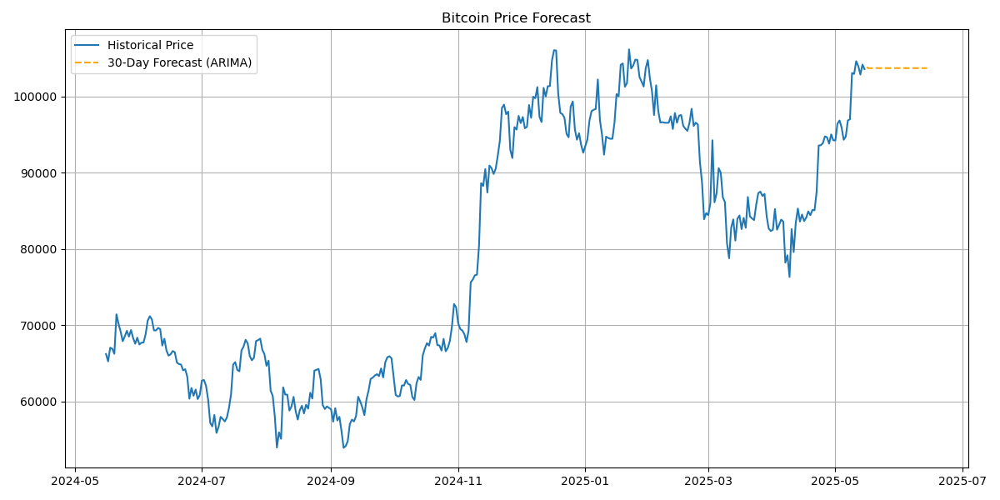
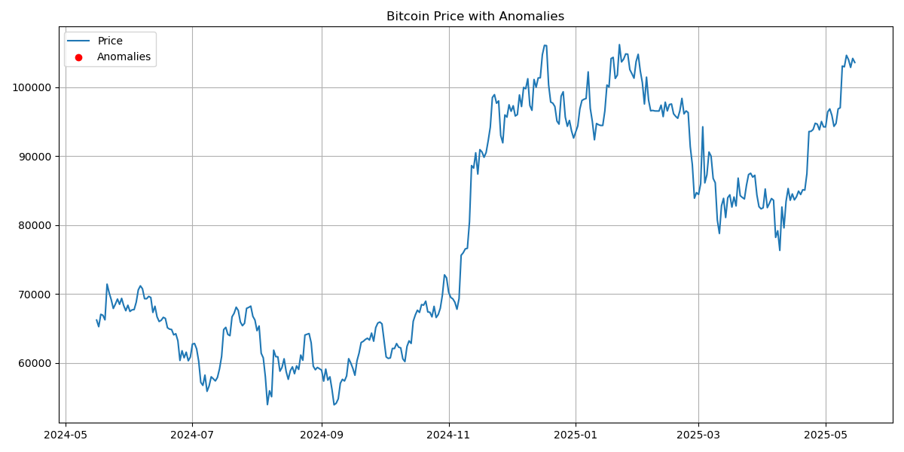

# 🧠 Time Series Analysis of Bitcoin Prices Using s3fs

**Author:** Karthik Vakada  
**Email:** [kvakada@umd.edu](mailto:kvakada@umd.edu)  
**Project Tag:** TutorTask114_Spring2025_Time_Series_Analysis_of_Bitcoin_Prices_Using_s3fs  
**Date:** May 2025  
**Live Dashboard:** [bitcoin-price-dashboard.onrender.com](https://bitcoin-price-dashboard.onrender.com)  
**GitHub Repository:** [github.com/kvakada/TimeSeries-Analysis](https://github.com/kvakada/TimeSeries-Analysis)

---

## 📝 Project Overview

This project demonstrates a reproducible, cloud-native pipeline for analyzing and forecasting Bitcoin prices using Python, ARIMA models, and native S3 access via `s3fs`. Unlike traditional pipelines that rely on static CSVs, this setup dynamically fetches data using the CoinGecko API and writes/reads directly from AWS S3. All code runs inside a standardized Docker environment based on the official `data605_style` template. Forecast results and anomalies are visualized in a Plotly-based dashboard.

---

## 📁 Project Structure

```

TutorTask114\_Spring2025\_Time\_Series\_Analysis\_of\_Bitcoin\_Prices\_Using\_s3fs/
├── bitcoin\_utils.py
├── fetch\_bitcoin\_data.py
├── Spring2025\_s3fs.API.ipynb / .md / .py
├── Spring2025\_s3fs.example.ipynb / .md / .py
├── requirements.txt
├── pyproject.toml
├── Dockerfile / start.sh
├── figures/
│   ├── bitcoin\_forecast\_plot.png
│   └── bitcoin\_anomalies\_plot.png
├── CSV/
│   ├── bitcoin\_prices.csv
│   ├── bitcoin\_prices\_processed.csv
│   └── bitcoin\_prices\_with\_forecast.csv
├── Bitcoin\_Prices\_Prediction\_Dashboard/  <- Plotly dashboard
├── dev\_scripts\_tutorial\_s3fs/
│   ├── docker\_build.sh, docker\_jupyter.sh, etc.

````

---

## ⚙️ Setup and Dependencies

### Core Dependencies

- Python 3.10+
- `pandas`, `matplotlib`, `statsmodels`, `scikit-learn`
- `s3fs`, `requests`, `seaborn`, `ARIMA`
- Jupyter Lab

Install with:

```bash
pip install -r requirements.txt
# or
poetry install
````

---

## 🐳 Docker Setup

> 🧪 This project uses the `data605_style` Docker template.

```bash
# Navigate to root directory
cd TutorTask114_Spring2025_Time_Series_Analysis_of_Bitcoin_Prices_Using_s3fs

# Build image
bash dev_scripts_tutorial_s3fs/docker_build.sh

# Launch notebook
bash dev_scripts_tutorial_s3fs/docker_jupyter.sh
```

📍 Ensure `~/.aws/credentials` is configured for S3 access.

---

## 🌐 Run Without Docker

```bash
python3 -m venv venv
source venv/bin/activate
pip install -r requirements.txt
jupyter lab
```

---

## 📒 Notebooks Overview

### 🔹 `Spring2025_s3fs.API.ipynb`

* Demonstrates listing, reading, writing with native `s3://` using `s3fs`
* Follows [official s3fs examples](https://s3fs.readthedocs.io/en/latest/#examples)

### 🔹 `Spring2025_s3fs.example.ipynb`

* Fetches data via `fetch_bitcoin_data()`
* STL decomposition, volatility analysis, Z-score anomaly detection
* Forecasts using ARIMA and log-ARIMA
* Saves and loads data from AWS S3 dynamically

---

## 📷 Sample Output Visualizations

#### 🔮 Forecast Curve (ARIMA)



#### 🚨 Z-score Anomalies



---

## 🔐 API Configuration

```python
from bitcoin_utils import fetch_bitcoin_data
df = fetch_bitcoin_data(days=365)
```

> AWS credentials must be configured in `~/.aws/credentials`.

---

## 📊 Output Summary

* 📈 Daily price trend + moving average
* 🧮 STL decomposition (trend/seasonal/residual)
* 🚨 Z-score anomaly detection
* 🔮 Forecasting with ARIMA & log-ARIMA
* ☁️ S3 integration via `s3fs` (no local storage)


---

## 📊 Live Dashboard

An interactive Plotly dashboard is hosted at:
🔗 [https://bitcoin-price-dashboard.onrender.com](https://bitcoin-price-dashboard.onrender.com)

Source code is inside: `Bitcoin_Prices_Prediction_Dashboard/`

---

## 🔁 Reproducing the Project

```bash
git clone https://github.com/kvakada/TimeSeries-Analysis.git
cd TutorTask114_Spring2025_Time_Series_Analysis_of_Bitcoin_Prices_Using_s3fs
bash dev_scripts_tutorial_s3fs/docker_build.sh
bash dev_scripts_tutorial_s3fs/docker_jupyter.sh
```

Or for local execution:

```bash
python3 -m venv venv
source venv/bin/activate
pip install -r requirements.txt
jupyter lab
```

---

## 💡 Optional Extensions

* Add real-time dashboard updates
* Use LSTM or Prophet for extended forecasting
* Alert system with AWS SNS for anomaly detection
* Deploy via AWS Lambda (serverless)

---

## ✅ Final Notes

This project was built for **DATA605 – Spring 2025**, following the official `Causify AI` structure. It demonstrates:

* Live API ingestion + native S3 integration
* Classical time series modeling with ARIMA
* Reproducibility via Docker (`data605_style`)
* Visualization via Plotly Dashboard

📫 For questions, contact: [kvakada@umd.edu](mailto:kvakada@umd.edu)
