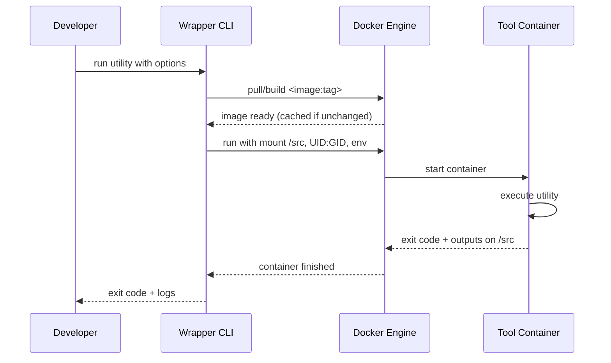
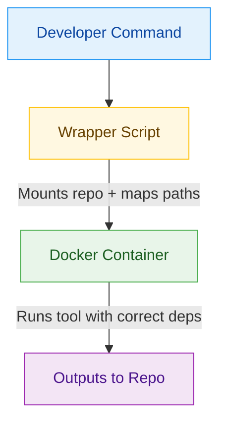

Have you ever spent hours trying to install a tool, only to hit version
conflicts or mysterious errors? Do you need to run the same tool on different
computers (e.g., Mac vs Linux laptops vs AWS dev servers vs CI servers), having
problems maintaining the tools aligned, or even just building?

At Causify, we face this problem repeatedly with different developer utilities.
To solve it, we introduced a toolchain pattern we call **Dockerized Executables**.

Instead of baking every utility into one "kitchen-sink" dev image, we **package
each tool in its own slim image** and run it on demand. That keeps the base dev
environment lean, avoids cross-tool dependency conflicts, and lets us
version/upgrade/rollback tools independently without rebuilding the whole stack.
CI and local caches pull only what’s needed, which speeds builds and reduces
churn, and the smaller, purpose-built images also shrink the security surface.
In short: per-tool containers give us cleaner isolation and faster iteration
than a single all-in-one image. Developers call the familiar tool name, but
behind the scenes, it runs inside a container with all its dependencies
pre-packaged and controlled.

The container image includes everything required to run the tool. A thin Python
wrapper handles mounting the repository and path conversions across Docker and
user space, and the output lands directly back in the workspace. From the
developer’s perspective, a Dockerized Executable behaves the same as a local
install, just **without** the setup pains or environment drift.

<!-- more -->

## Why We Built This

- **Installation struggles:** Some tools require long setup guides, heavy
  dependencies, or fragile environment configs.
- **Inconsistent environments:** A tool might behave differently across macOS,
  Linux, and CI pipelines.
- **Recurring time sink:** Installing and configuring utilities often leads to
  wasted time debugging setups before real work can begin.

## How It Works

When a developer runs a command, our wrapper script:

- **Pulls or builds** the correct Docker image (cached on repeat).
- **Mounts** the repo (and input files) into the container (e.g., at `/src`).
- **Converts paths** between host and container file systems.
- **Runs** the tool inside the container with the requested options.
- **Writes outputs** back into the repo and **propagates the exit code**.

It feels identical to a local install, but it’s **reproducible** and
**environment independent**.

## Example: Document Conversion Via a Dockerized Executable

**Goal:** Convert a `.docx` file to Markdown without installing the converter
locally.

```bash
python dev_scripts_helpers/documentation/convert_docx_to_markdown.py \
  -i docs/weekly_update.docx \
  -o docs/weekly_update.md
```

**What happens under the hood (aligned with our flow):**

- The Wrapper Ensures the Converter’S Docker Image Is Available (Pull/Build
  if needed). 
- The Repository (And the `docs/` Files) Is Mounted Into the Container
  (e.g., at `/src`).
- Paths Are Mapped Automatically (E.G., `docs/weekly_update.docx` →
  `/src/docs/weekly_update.docx`).
- The Tool Runs Inside the Container; the Generated `docs/weekly_update.md`
  is written back to your workspace.

**Outcome:** Same result as a local install, but with no host setup, consistent
behavior across macOS/Linux/CI, and version-controlled tooling.

## Other Examples We’Ve Dockerized

1. **Formatting Docs/Code** 

    - **Script:** [dockerized_prettier.py](https://github.com/causify-ai/helpers/blob/master/dev_scripts_helpers/documentation/dockerized_prettier.py)  
    - Use: Apply consistent formatting across Markdown and source files.

2. **Diagram Rendering (Mermaid / Graphviz / Tikz)** 

    - Scripts: 
        - [dockerized_mermaid.py](https://github.com/causify-ai/helpers/blob/master/dev_scripts_helpers/documentation/dockerized_mermaid.py)  
        - [dockerized_graphviz.py](https://github.com/causify-ai/helpers/blob/master/dev_scripts_helpers/documentation/dockerized_graphviz.py)  
        - [dockerized_tikz_to_bitmap.py](https://github.com/causify-ai/helpers/blob/master/dev_scripts_helpers/documentation/dockerized_tikz_to_bitmap.py) 
    - Use: Render architecture/flow diagrams and convert vector sources to 
        bitmaps inside containers (no local installs).

3. **Latex PDF Builds** 

    - **Script:** [dockerized_latex.py](https://github.com/causify-ai/helpers/blob/master/dev_scripts_helpers/documentation/dockerized_latex.py)  
    - Use: Build PDFs reproducibly without installing LaTeX on the host/dev container.

4. **Llm-Powered Markdown Transforms** 

    - **Script:** [llm_transform.py](https://github.com/causify-ai/helpers/blob/master/dev_scripts_helpers/llms/llm_transform.py)
    - Use: Structured content rewrites (e.g., polishing notes to Markdown).

## Technical Guide: Building a Dockerized Executable

### High-Level Steps

- **Package the tool in a container image.** Choose a small base image, install
   the toolchain, pin versions, and set a safe default entrypoint/working
   directory.

- **Provide a thin wrapper CLI.** It should forward args, mount the repo, map
   paths, pass required env vars, set UID/GID, stream logs, and return the
   tool’s exit code.

- **Decide how it runs inside dev containers.** Prefer the **sibling** pattern
   (dev container → host Docker → tool container) unless you truly need
   Docker-in-Docker.

- **Normalize paths.** Compute paths relative to the repo root and rewrite them
   to the container mount (e.g., `/src`).

- **Harden and cache.** Build with content-addressable layers, avoid leaking
   secrets into layers, and tag images clearly.

- **Test like production.** Invoke the same wrapper you ship; assert on files,
   logs, and return codes.

### Minimal Image (Illustrative)

```dockerfile
FROM debian:stable-slim
# Install Your Toolchain and Runtime Here
# RUN Apt-Get Update \
# && Apt-Get Install -Y <Your-Tool> <Dependencies> \
# && Rm -Rf /Var/Lib/Apt/Lists/*

# Create a Non-Root User (Recommended)
RUN useradd -ms /bin/bash appuser
USER appuser

# Work Inside the Mounted Repository Path
WORKDIR /src

# Use a Simple Shell Entrypoint; the Wrapper Supplies the Command
ENTRYPOINT ["/bin/sh", "-lc"]
```

### Wrapper CLI Responsibilities (Summary)

- Discover the **Repo Root**.
- Mount Repo **Read/Write** Into the Container (E.G., `/src`).
- Convert Input/Output Paths to `/src/...`.
- Whitelist and Pass Through Only the Environment Variables the Tool Needs.
- Run Container as the Caller’S **UID\:GID** to Prevent Root-Owned Outputs.
- **Stream Logs** and **Propagate Exit Code**.

### Why "discover the repo root" Matters

When a tool runs inside a container, we need one stable mount point so paths
mean the same thing on the host, in a dev container, and inside the tool
container. We use the **repository root** as that anchor:

- **Consistent Path Mapping:** Inputs Like `docs/notes.md` Are Resolved
  relative to the repo root and then rewritten to the container path (e.g.,
  `/src/docs/notes.md`). This avoids "file not found" errors from
  absolute/host-specific paths.
- **Works From Any Subdirectory:** Developers Often Run Commands From
  `docs/` or `scripts/`. Resolving paths against the repo root means the same
  command works no matter where it’s launched.
- **Children Vs. Sibling Containers:** with Sibling Containers (Dev
  container → host Docker → tool container), the mount must reference a
  **host-visible path**. Using the repo root ensures the right directory is
  mounted across both patterns.
- **Minimal, Predictable Mount:** Mounting Only the Repo Root Keeps the
  environment lean and avoids exposing unrelated host directories.
- **CI Parity:** CI Checks Out the Repo Into Different Paths. A
  repo-root–based mount keeps commands stable across laptops, dev containers,
  and CI runners.

### Illustrative Container Invocation

```bash
docker run --rm \
  -u "$(id -u):$(id -g)" \
  -v "<repo_root>:/src" -w /src \
  <image:tag> <entrypoint-or-cmd> <args...>
```

### Path-Mapping Algorithm (Portable)

1. Normalize the caller’s path (host or dev container).
2. Resolve to repo-relative (`rel_path`).
3. Rewrite to container path: `/src/${rel_path}`.

## Sequence Diagram (Build + Run)



## Workflow Diagram



## Running Inside Containers

Many of our developers already work inside dev containers. Running a
containerized tool inside another container requires careful handling. There are
two approaches:

- **Children Containers (Docker-In-Docker):** One Container Launches
  another. Flexible but requires elevated privileges.
- **Sibling Containers:** the Dev Container Communicates with the Host’S
  Docker engine to launch another container. Safer and more efficient, but
  requires thoughtful mount management.

At Causify, we **prefer the sibling approach** for most workflows.


## Testing the Flow

- Simulate Real Usage by Invoking the **Same Wrapper** a Developer Would
  use.
- Containers Run with Their **Normal Entry Points** and Configurations.
- Assertions Check **Outputs, Logs, or File Changes**.
- This Avoids Contrived Test Setups and Ensures Reliability.

## Typical Use Cases

- Formatting and Linting Code or Docs.
- Converting Documents Into Different Formats.
- Rendering Diagrams and Charts.
- Building Reproducible Pdfs.
- Applying Lightweight ML/LLM Utilities for Structured Transforms.

## Benefits Recap

- **Reproducibility:** Consistent Behavior Everywhere.
- **Onboarding Speed:** Docker Is the Only Dependency.
- **Clean Environments:** No More Cluttered Local Installs.
- **Controlled Upgrades:** Images Are Version-Pinned and Reviewed.
- **Cross-Platform Stability:** Works Seamlessly Across Macos, Linux, and
  CI.

## Related Work

When thinking about reproducible tooling, our Dockerized Executable flow is not
the only approach in the ecosystem. Similar ideas have emerged in the Python
world with tools like **uv**, which aim to solve dependency management in a more
focused way.

### Uv for Python Packages

- **What It Does:** `uv` Is a Rust-Based Package Manager for Python. It
  installs both Python itself and project dependencies into isolated, cached
  environments.
- **Philosophy:** Prevent "dependency hell" by Guaranteeing That Everyone on
  a team resolves to the same versions, without polluting the global
  environment.
- **Strengths:** Extremely Fast Installs, Lightweight, and Tailored
  specifically to Python workflows.
- **Limitations:** Scope Is Narrow, It Only Solves Problems Within the Python
  ecosystem.

### Dockerized Executables at Causify

- **What We Do:** Instead of Targeting One Language, We Containerize Any
  developer utility—from formatters to document converters to diagram renderers.
- **Philosophy:** Eliminate Setup Headaches by Running Tools in Docker
  images that include all their dependencies.
- **Strengths:** Works Across Languages and Ecosystems, Consistent Behavior
  across laptops, dev containers, and CI.
- **Limitations:** Requires Docker, and Images Are Heavier Than Python
  wheels. There is also a small first-run latency to pull/build the image.

### Comparison

Both approaches are rooted in the same principle: tools should be easy to run,
reproducible, and isolated from the host environment. `uv` brings that guarantee
to **Python packages**, accelerating installs and ensuring consistent
environments. Causify’s Dockerized Executables bring the same guarantee to
**system-level tools and utilities**, many of which live outside Python’s
packaging ecosystem.

### Why We Still Need Both

Teams that are Python-heavy can benefit from `uv`’s lightning-fast dependency
resolution. For everything else and especially tools that cross language
boundaries or have system-level dependencies, our Dockerized Executable flow
fills the gap.

## Technical References

- [all.notes_toolchain.how_to_guide.md](https://github.com/causify-ai/helpers/blob/master/docs/tools/documentation_toolchain/all.notes_toolchain.how_to_guide.md)
- [all.dockerized_flow.explanation.md](https://github.com/causify-ai/helpers/blob/master/docs/tools/docker/all.dockerized_flow.explanation.md)

## Closing Thoughts

If you’ve ever lost hours to installation issues, you know the frustration. With
Dockerized Executables, Causify developers spend less time wrestling with setups
and more time building. The result is faster onboarding, cleaner environments,
and a reliable experience from device to CI.