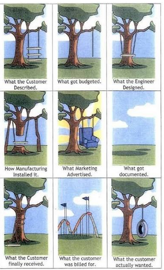

**“What’s the ETA for feature XYZ?”**  
**“When will feature XYZ be done?”**

Last time I counted, I've been asked and I've asked those questions about 14,400 times in 20 years I've spent in the coding trenches.

## Why this question is uncomfortable

I am uncomfortable with this question since it evokes deeper questions like:

- *What if it takes longer?* (will my reputation of coding machine be tarnished by this?)  
- *What if it takes shorter?* (will I look like a fool for thinking something so simple was actually complex?)  
- *What should I answer to make the business folks happy* (to people-please)  
- *Can the business survive if I say that it will take 3× longer than our available runway?*

I’m also an optimist by nature, and I heard people ironically say *“it will take GP 5 minutes”* as a way to highlight that. From time to time, I’ve shown that it can take 5 minutes to get it done. In 1997, I did write a Tetris clone in a single night of coding in TurboPascal 7 after being dared that was not possible.

All these personal details highlight that I understand the **psychological problem** that asking “what’s the ETA” summons.

<!-- more -->

## Engineers and ETA

Engineers are uncomfortable with this question to the point of having an allergic reaction. I’ve heard so many times:

- *“ETAs are impossible to do”* (based on the famous ETA-impossibility theorem)  
- *“ETAs are wrong in any case, why even try?”* (not self-defeating at all)  
- *“It’s done when it’s done.”* (ok, then what do we do?)  
- *“I am an artist, you can’t put pressure on genius”* (true words)  

The surprising thing is that as soon as the same ETA-allergic engineers start wearing a manager hat, they perform a 180 and start demanding precise estimates. This remarkable phenomenon is a consequence of the powerful medication to ETA-allergy called *“your-butt-is-on-the-line”*.

Steve Jobs (considered either a modern genius or a useless appendix stealing credit from a great team) went from insisting on endless tweaks to the GUI and case design to *“real artists ship!”*.

The Agile movement tried to solve this problem with a sneaky *“we don’t measure in hours, but in points”* and then secretly reverse-engineer how to convert points into hours. Of course, engineers saw right through this and went back to invoking the corollary of the ETA-impossibility theorem extended to points.

Besides the true psychological effect, these excuses are all **bullshit**. Going to the dentist is uncomfortable but we still go.

## Why ETAs matter

Any company needs ETAs to plan and function. Things can be marketed when they are ready at some point in the future.

**Here is a solution:**

1. Make your boss understand that an ETA is difficult and why.  
2. Acknowledge that the answer to *“what’s the ETA?”* depends on many hidden factors that can dramatically change the timeline and outcome.  
3. Make clear that you and your team will do your best but there is a non-zero probability that you will estimate incorrectly.  
4. Come up with an agreed-upon process to estimate ETA, measure it, and propagate through the chain of command.  
5. Accuracy should improve as work progresses.  
6. Do your best to achieve the goal by measuring progress, changing scope, going the extra mile when necessary.  

## An analogy

If your manager doesn’t understand why you can’t answer *“How long will it take to XYZ?”*, you can ELI5 with a simple analogy:

Answering *“what’s the ETA”* is the same as asking:

> **“Here’s a book of crossword puzzles. How long would it take you to solve all of them?”**

The only valid answer is: *“well, it depends…”*

## What it depends on

### Context Matters
The meaning of “done” shifts depending on who’s asking and why.

- Is it a prospective customer holding back a deal until the feature is ready?  
- Is it a long-time happy customer asking for a nice-to-have improvement?  
- Is it a critical requirement that could break the product if not shipped immediately?  

Each of these situations creates a different urgency and investment level.  
- A deal-blocker feature may demand sleepless nights.  
- A low-priority request might fit into the backlog months later.  

### Team and Resources
“1 week” means very different things depending on who’s working on it:

- One developer working solo vs. a team of five.  
- A senior engineer who knows the codebase deeply vs. a new hire still onboarding.  
- A team already at capacity vs. a team with room to take on new work.  

### Specifications and Collaboration
Even with the right people, execution depends on how clear the specs are.

- Are requirements well-defined, or are they evolving?  
- Will the customer collaborate when questions come up, or will they go silent?  
- Do they mean “XYZ” when they say it, or will they later clarify that they actually needed “ABCXYZW and maybe J”?  

A fuzzy request can triple the time required compared to a well-scoped feature.

### Dependencies and Risks
Sometimes the bottleneck isn’t inside the team, it’s outside.

- Does the customer need to provide input, assets, or approvals?  
- Are we waiting on third-party integrations or external APIs?  
- Is the new feature stacked on top of legacy code that’s fragile to touch?  

The more dependencies, the less predictable the ETA.

## So, What’s the ETA?

When someone asks, *“How long will this take?”*, the honest answer is: **It depends.**

Timelines are shaped by context, resources, clarity, and dependencies. A feature might be a one-week sprint—or a six-month slog.

The best teams don’t just throw out estimates. They dig into the why, the who, and the what behind the request before committing.

Because in the end, *“done”* isn’t just about shipping code, it’s about delivering the right thing, at the right time, with the right trade-offs.

## ETA Folklore

Widely cited “rules of thumb” for estimation and planning in engineering and management. I’ve experienced and vouch for all of them.

- **Watercooler ETA**  
  Never estimate casually at the watercooler (“Yeah, I’d crush X in Y minutes”).  
  Those estimates will come back to haunt you.

- **Middle-Manager Lies**  
  Tell management it will take twice as long as you think.  
  Tell your staff they have half the time you feel they have.  
  (Lying is never advisable, but this trick has been used for a long time.)

- **Multiply by π**  
  Pick a reasonable estimate in days, multiply it by π, and round it up to the nearest number of weeks/months.  
  It works pretty well in practice, since estimates are often off by between 1 and 1 order of magnitude.  

- **The 90/90 Rule**  
  The first 90% of the code accounts for the first 90% of the development time.  
  The remaining 10% of the code accounts for the other 90% of the development time.

- **Hofstadter’s Law**  
  It always takes longer than you expect, even when you take into account Hofstadter’s Law.  

- **Brooks’ Law**  
  Adding manpower to a late software project makes it later.  

- **Parkinson’s Law**  
  Work expands so as to fill the time available for its completion.  

- **The 1–2–4 Rule**  
  If you think it’ll take 1 day, budget 2 days.  
  If you think it’ll take 1 week, budget 2 weeks.  
  If you think it’ll take 1 month, budget 4 months.  

- **The Law of Triviality (Bikeshedding)**  
  Teams spend disproportionate time on minor, easy-to-grasp details while ignoring the big, hard issues.

- **Under, Over, Done**  
  Always give three estimates:  
  - Optimistic (under): if everything goes right (it never does).  
  - Pessimistic (over): if everything breaks.  
  - Most likely (done): your actual best guess.  
  (This communicates uncertainty without pretending to be precise.)

