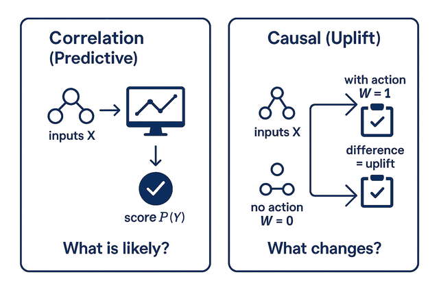
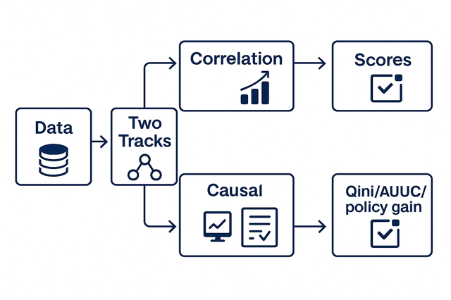
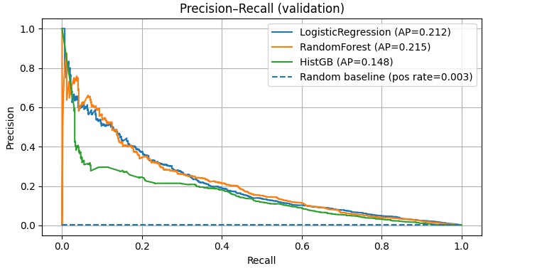
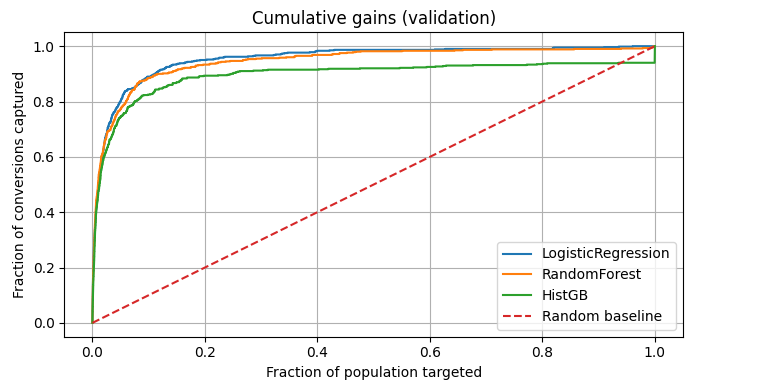
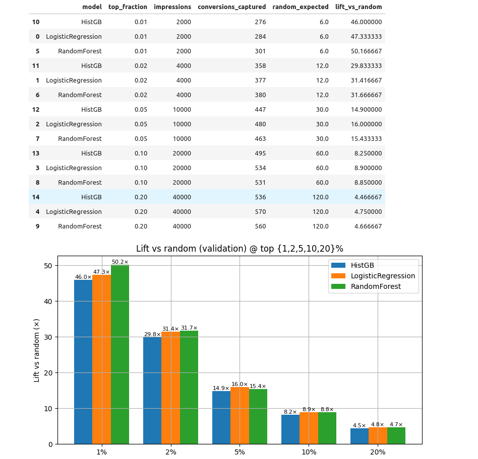
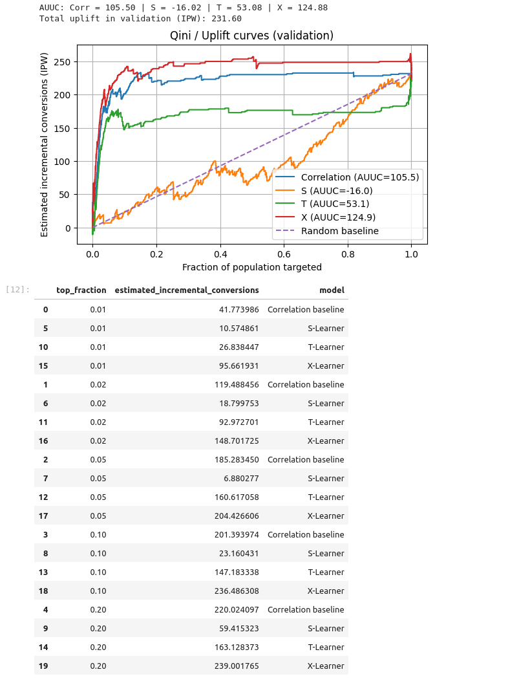
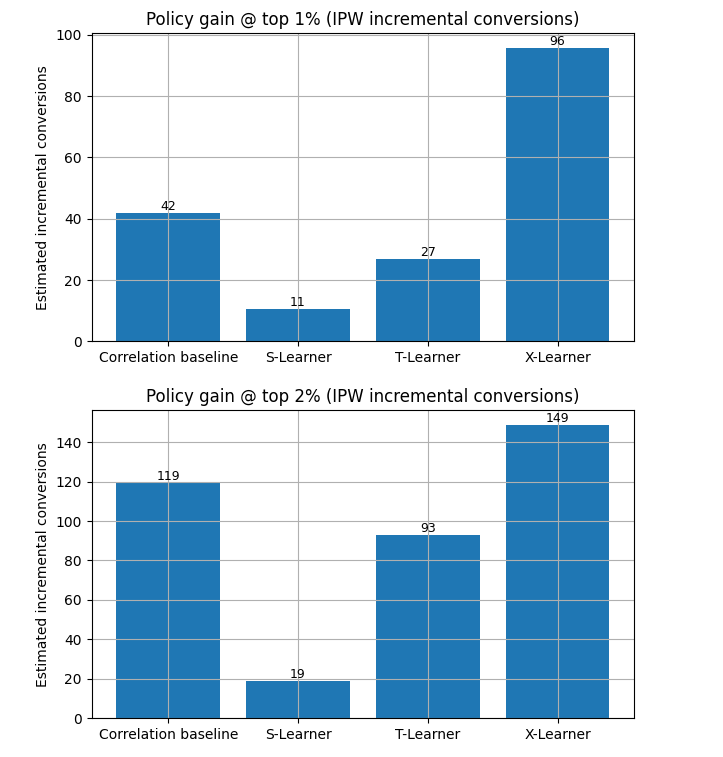

# What’S the Difference?

- Correlation AI (predictive modeling) answers: "What is likely to happen?" It
  finds patterns between inputs and past outcomes to predict probabilities
  (e.g., who will buy, fail, churn).
- Causal AI (uplift / treatment-effect modeling) answers: "What will change if
  we take an action?" It estimates outcomes with and without an intervention for
  the same person and focuses on the difference (the incremental effect).

Why this matters (in any domain).

Whenever resources are limited like ads, discounts, reminders, inspections,
interventions, you don’t want to target those who would have done it anyway. You
want the persuadables: people whose behavior changes because of your action.
That’s the core promise of causal AI.

# How We’Ll Demonstrate It (Plan at a Glance)

We’ll work through a concrete, large-scale example to show how causal uplift
outperforms a strong correlation baseline at creating incremental results under
the same budget. The example happens to be ad targeting (because we have a clean
public dataset), but the method carries to finance, energy, supply chain,
health, etc.

## What We’Ll Build and Compare:

- Correlation baseline: predict what will happen (likelihood of the outcome) and
  rank by that score.
- Causal uplift models (S-/T-/X-Learners): estimate what changes because of the
  action and rank by uplift.
- Same data, same sample, same split for a fair comparison.
- Evaluation matched to the question:
  - Predictive track: PR-AUC, cumulative gains, lift vs random (total outcomes).
  - Causal track: Qini / AUUC and policy gain @ top X% (incremental outcomes).
- Decision-level comparison: At the same budget (e.g., target the top 1%), which
  approach yields more extra outcomes?

# The Dataset & Problem Statement for Our Example

To make this reproducible, we use the Criteo Uplift open dataset (public, large,
randomized). Each row represents one user impression with

- 12 anonymized features (f0..f11),
- `treatment` indicating whether the action occurred (ad shown),
- `conversion` indicating whether the outcome happened (purchase).
- We remove post-action signals (visit, exposure) to avoid leakage.

## Problem Statement (Neutral Phrasing)

Given features known before a decision, decide whom to act on to maximize
incremental outcomes (people who do the thing because of our action). We’ll
implement both approaches—correlation and causal—and show the difference
empirically.

| Role                         | Columns             | When Available    | Notes                                                                                                  |
| ---------------------------- | ------------------- | ----------------- | ------------------------------------------------------------------------------------------------------ |
| **Features (inputs)**        | `f0` ... `f11`      | **Pre-action**    | Anonymized numeric features used to score users.                                                       |
| **Action flag**              | `treatment`         | **At evaluation** | 1 = ad shown, 0 = no ad. **Not** used as an input in correlation; used structurally in causal (S/T/X). |
| **Target (outcome / label)** | `conversion`        | **Post-outcome**  | 1 = purchased, 0 = not purchased. This is the **y** variable (never a feature).                        |
| **Dropped (post-action)**    | `visit`, `exposure` | **Post-action**   | Removed to avoid leakage; these happen after showing the ad.                                           |

# How We’Ll Run the Example (Nutshell)

- Sample & split: Use a 1,000,000-row sample from Criteo for speed; 80/20
  train/validation split (stratified on the outcome); fixed random seed for
  reproducibility.
- Correlation track: Train standard models (incl. Logistic Regression) to
  predict probability of outcome from features only. Rank by probability; assess
  PR-AUC, cumulative gains, lift vs random.
- Causal track: Train S-/T-/X-Learners (uplift meta-learners) that produce
  uplift scores per person (how much the action changes the outcome). Rank by
  uplift; assess Qini/AUUC and policy gain @ top X% using the dataset’s
  randomized design.

From here, we dive into the step-by-step Correlation track, then the Causal
track, and finally put the results side-by-side.

# Correlation Track - Predict "Who Will Buy?"

## Objective

Build a strong predictive baseline that answers `Who is likely to convert?`
We’ll rank users by conversion probability and evaluate both model
discrimination and business targeting.

## Data & Setup (Recap)

- Sample: 1,000,000 rows from Criteo Uplift (fixed seed).
- Split: 80/20 train/validation, stratified by conversion.
- Inputs: features f0..f11.
- Target (y): conversion.
- Dropped: `visit`, `exposure`.
- We do not use `treatment` as a feature in this track.

## Models

- Logistic Regression (scaled)
- Random Forest
- HistGradientBoosting

All preprocessing is done via scikit-learn Pipelines to avoid leakage (median
impute; scale only for the linear model).

## What the Score Means

Each model outputs a probability of conversion. We rank users by this
probability (highest → lowest).

## Results

### Predictive Discrimination

- `Logistic Regression`: AUC ≈ 0.956, PR-AUC ≈ 0.212
- `Random Forest`: AUC ≈ 0.948, PR-AUC ≈ 0.212
- `HistGB`: PR-AUC ≈ 0.148

PR-AUC matters because positives are rare (~0.29%); a random model would be
~0.003.

Because conversions are extremely rare (~0.3%), we evaluate ranking quality with
a Precision–Recall (PR) curve rather than accuracy. Each model outputs a
probability of conversion and we rank users by that score (no fixed threshold).
The PR curve shows precision as we sweep recall from 0→1. Our Logistic
Regression and Random Forest deliver Average Precision (AP) ≈ 0.212–0.215, far
above a random baseline at the positive rate ≈ 0.003. This confirms the
correlation models are excellent at finding likely buyers—a strong baseline to
compare against causal uplift.

### Business Targeting (Top-X by Probability)

We simulate "target the top X%" and count total conversions captured vs a random
baseline.

- Top 1%: RF ~300 vs random ~6→ ~50× lift; LogReg ~284 vs ~~6 → ~47×.
- Similar strong lifts at 2% / 5% / 10%.

Chart - Cumulative gains (what it shows & how to read it)

The below chart answers if we rank everyone by predicted conversion probability
and target the top X%, what fraction of all conversions do we capture? The curve
climbs quickly when the model places true converters near the top. A perfect
model would shoot straight up; a random policy is the diagonal. Our curves
(LogReg/RF) sit far above random, meaning most conversions are concentrated in
the top slices, evidence that the correlation models are excellent at finding
likely buyers.

Takeaway: strong probability ranking concentrates conversions early → great for
total conversions, not necessarily incremental ones.

Chart - Lift vs random (what it shows & how to read it)

The bar chart below compares how many conversions we capture in the top
{1,2,5,10,20}% against what we’d expect from random selection of the same size.
A value like 50× at 1% means the model’s top 1% contains ~50 times more
conversions than random would. That’s outstanding for maximizing total
conversions but some of these people might have bought anyway, which is why we
later switch to causal uplift to measure extra conversions caused by the ad.

Takeaway: huge total-conversion lift at tight budgets; next we check incremental
lift with causal models.

## Takeaway (Correlation)

Correlation modeling is excellent at finding buyers and delivers big
total-conversion gains at fixed budgets. But it does not try to find customers
who change behavior because of the ad, which is what drives incremental ROI.

# Causal Track - Predict "Who Will Change Because of the Ad?"

## Objective

Estimate uplift: the difference between a person’s chance to convert with the ad
and without the ad. Rank by this incremental effect to target persuadables.

## Data & Setup (Same as Correlation)

- Same 1M sample, same 80/20 split, same features, same preprocessing.
- We use treatment structurally (not as a plain feature for scoring) to learn
  two worlds per person.

## Meta-Learners We Tried

- `S-Learner`: one model asked twice (with-ad vs without-ad).
- `T-Learner`: two separate models (treated-world specialist vs no-ad-world
  specialist).
- `X-Learner`: imbalance-friendly; learns the difference more directly and
  blends both sides.

(We used HistGradientBoosting as the base model for speed and nonlinearity; any
base learner could be swapped in.)

## What the Score Means

- Each model outputs an uplift score per person = "how much the ad increases the
  chance to convert."
- We rank users by uplift (highest → lowest).

## How We Evaluate Uplift

- Qini / AUUC: area under the uplift curve. Higher = more incremental
  conversions overall.
- Policy gain @ top X%: estimated incremental conversions if we target the top
  X% (using inverse propensity weighting; valid here because the dataset is
  randomized).

## Results

### Uplift Curves (AUUC)

- Correlation baseline (uplift-eval of prob ranking): AUUC = 105.5
- S-Learner: −16.0 (struggles with 85/15 imbalance)
- T-Learner: 53.1
- X-Learner: 124.9 (best overall)

The Qini / uplift curves show estimated incremental conversions (IPW) as we move
from targeting the top 0% → 100% of users by each model’s score. A higher,
steeper curve means the model is better at surfacing persuadable users early. In
our run, the X-Learner dominates, with AUUC ≈ 124.9 versus Correlation ≈ 105.5,
T-Learner ≈ 53.1, and S-Learner ≈ −16.0 (hurt by the 85/15 treatment imbalance).
The table below translates that ranking into concrete numbers at fixed budgets:
at top 1%, X-Learner yields ~95.7 incremental conversions versus ~41.8 for the
correlation baseline (≈2.3× more). Because the dataset is randomized, we
estimate incremental lift using inverse-propensity weighting, which fairly
compares treated vs control within each targeted slice. Bottom line: with the
same spend, uplift targeting (X-Learner) creates more extra conversions across
the population, not just at a single cutoff.

### Policy Gain (Incremental Conversions @ Fixed Budgets)

At the same target sizes (same spend), X-Learner yields more extra conversions:

| Target slice | Correlation | T-Learner | X-Learner |
| -----------: | ----------: | --------: | --------: |
|   **Top 1%** |        41.8 |      26.8 |  **95.7** |
|   **Top 2%** |       119.5 |      93.0 | **148.7** |
|   **Top 5%** |       185.3 |     160.6 | **204.4** |
|  **Top 10%** |       201.4 |     147.2 | **236.5** |
|  **Top 20%** |       220.0 |     163.1 | **239.0** |

With the same budget, uplift targeting (X-Learner) creates more extra
conversions than correlation.

These bar charts answer a budget question: If we target only the top slice of
users, how many extra conversions do we create? At top 1%, the X-Learner yields
about 96 incremental conversions, beating the correlation baseline (~42) and the
other uplift variants (T ≈ 27, S ≈ 11). At top 2%, the pattern holds: X ≈ 149 vs
Correlation ≈ 119, T ≈ 93, S ≈ 19. Because the dataset is randomized, we
estimate these numbers with inverse-propensity weighting, which fairly compares
treated vs control within each targeted slice. The takeaway: with the same
spend, uplift targeting (X-Learner) finds more persuadable users and delivers
more incremental conversions than ranking by probability.

### Why X > T > S

- S-Learner uses one model for both worlds; with heavy imbalance (85% treated /
  15% control), it guesses the rare world poorly.
- T-Learner trains two specialists (one per world), improving stability.
- X-Learner goes further: it explicitly learns the difference and blends both
  sides using the observed treatment share, ideal for imbalance → best uplift
  ranking.

# Takeaway (Causal)

Causal uplift modeling optimizes the right objective, incremental impact and, on
this dataset, beats a strong correlation baseline on AUUC and at every practical
budget cut (especially at the tightest one, top-1%).

# Conclusion

In decisions where budget is limited, predicting who will buy is not enough, you
need to know who buys because of you. On the same data, sample, and split, our
X-Learner uplift model delivered a higher AUUC and ~2.3× more incremental
conversions at the top 1% than a strong correlation baseline. In practice, that
means more impact from the same spend. The pattern generalizes beyond ads to
finance (offers), energy (demand response), supply chain (expediting), and
healthcare (outreach), whenever actions are costly, target the persuadables.
